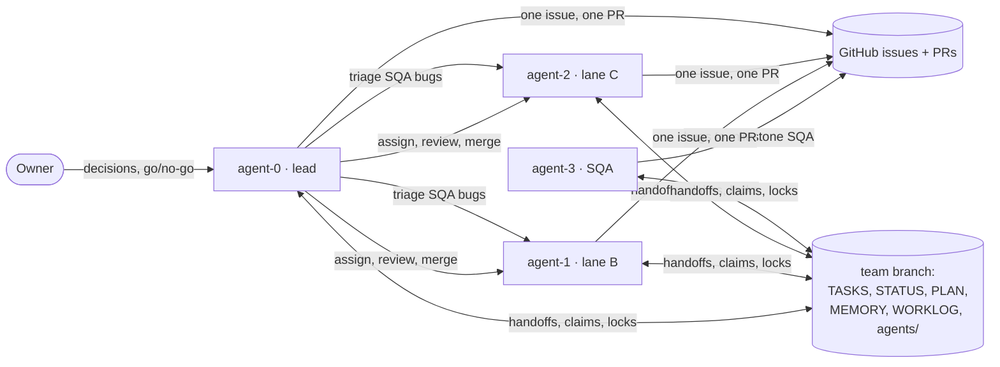

# Developer agents

DeutschPlan is built by a team of four Claude Code agents working for one
owner. This folder is how a new machine, or a new session, learns who the
team is, how each agent works, and what each one remembers. **On a new
device, read this page first**, then the folder of the identity you take.

| | Role | Lane | Folder |
|---|---|---|---|
| **The owner** | MdRahmatUllah: decides product questions, app ids, signing, releases; reads the board and the PR list | — | — |
| **agent-0** | The lead: the critical path, assignments, reviews, merges, releases | A: quiz, exam runner, release | [`agent-0/`](agent-0/) |
| **agent-1** | Developer | B: voice, words, search, translation, polish | [`agent-1/`](agent-1/) |
| **agent-2** | Developer | C: Me, settings, exam engine, platform, accessibility | [`agent-2/`](agent-2/) |
| **agent-3** | The one and only SQA: tests closed issues on its own emulator, files bugs | SQA milestone | [`agent-3/`](agent-3/) |

**In numbers, up to v1.0.1** (2026-09-21 to 2026-09-26; details in each `work-history.md`):

| | PRs merged | Reviews for others | Notes |
|---|---|---|---|
| Before the team (M0–M3) | 101 (#176–#279) | a self-review pass on each | one Claude Code session, working alone; it went on as agent-0 (inferred) |
| agent-0 | 66 | about 57 | also 9 epics, milestones M4–M7, and both release tags |
| agent-1 | 65 | about 49 | 14 of its issues were SQA bugs |
| agent-2 | 57 | about 54 | ran the milestone and release gates |
| agent-3 | — | 5 PRs checked on the device before merge | 42 bugs filed (4 P1, 21 P2, 17 P3); 36 verified fixed on the device |

Each agent folder has:

- `README.md`: the role, how the agent runs a session, and how it takes one task from claim to merge;
- `memory.md`: what that agent remembers (a snapshot of its board memory, plus the shared memories that are its own);
- `work-history.md`: what it built, and how.

[`shared-memory/`](shared-memory/) holds the Claude Code memory files every
agent on the old machine shared: the owner's rules, the lessons, the SQA
ledger. They are local files, so they don't travel with a clone; this copy
does (see "Restore the memory" below).

## How the team fits together



- **The board** is the `team` branch of this repo, never merged into `main`.
  Only `python tools/team.py` changes it (claims, handoffs, locks, memory).
  It is the live state; this folder is a snapshot plus the durable "how".
- **GitHub** holds the work: one issue, one branch `feat/<N>-<slug>`, one PR
  (`Closes #N`), squash merge. Every agent acts as the owner's account, so
  each PR body starts with `**Agent-N**` on line 1 to say who wrote it.
- **The emulators**: the developers share `emulator-5558` under a local lock
  (`team.py device`). SQA has its own (`emulator-5556` today; `5554` is also
  reserved for it). Nobody touches another agent's emulator.
- **CI is off** (the owner's call, #302). The local gate is the only check.

The full procedure is [`ONBOARDING.md`](../ONBOARDING.md); the one-page
version is [`CLAUDE.md`](../CLAUDE.md). The product and the code are
explained in [`docs/handbook/`](../docs/handbook/README.md).

## Starting on a new device

Paths below use `<root>` for the folder that holds the main checkout (on the
first machine, `F:/appDevs`). The tools find everything relative to the main
checkout, so any `<root>` works.

1. **Install.**
   - Windows 11 with Git Bash (PowerShell where the docs say so). macOS or Linux works for everything except where a doc names a Windows path.
   - Flutter **3.47.5** / Dart 3.13.4 on `PATH` (the version in `.fvmrc`). There is no `fvm` and no `make`.
   - Python 3.10+ with `pip install -r tools/requirements.txt` (openpyxl, PyYAML, pytest), plus `pip install Pillow` for `tools/artboard.py`.
   - The Android SDK (platform-tools, emulator, an API 36 system image), and `ANDROID_HOME` if it isn't under `%LOCALAPPDATA%/Android/Sdk`.
   - `gh`, logged in as `rahmat-ullah`, and Claude Code.
2. **Clone and set the identity** (the owner's rule: everything that reaches
   GitHub is authored as the owner):
   ```bash
   git clone https://github.com/MdRahmatUllah/DeutschPlan.git <root>/deutschplan
   cd <root>/deutschplan
   git config user.name  "MdRahmatUllah"
   git config user.email "rahmat.ullah@infinitibit.com"
   ```
   The workbooks in `data/` are not in git. Copy them from the old machine
   only if you will change content.
3. **Restore the memory.** Start Claude Code once in `<root>/deutschplan`. Its
   system prompt names the memory folder ("You have a persistent file-based
   memory at …"), usually `~/.claude/projects/<root path, with : \ / as ->/memory/`
   (for `F:\appDevs\deutschplan` that is `F--appDevs-deutschplan`). Copy the
   shared memory into it:
   ```bash
   cp developer-agents/shared-memory/*.md ~/.claude/projects/<mangled-path>/memory/
   ```
   Every session started in the main checkout then loads the index
   (`MEMORY.md`) automatically.
4. **One worktree per agent** (never work in the main checkout; it stays on
   `main` for the owner):
   ```bash
   git fetch -q origin
   git worktree add --detach <root>/dp-wt/agent-N origin/main
   ```
   Then run the code generation sequence in it (`ONBOARDING.md` §2, "Your
   worktree"). Generated code is not committed (ADR 17).
5. **Emulators.** Create two AVDs (API 36). Start them on fixed ports so the
   serials match the rules the tools enforce:
   ```bash
   emulator -avd <sqa-avd> -port 5556      # agent-3's (tools/device.py also reserves 5554 for SQA)
   emulator -avd <dev-avd> -port 5558      # the developers', tools/device.py's default
   ```
   Device checks use a release x64 APK (`flutter build apk --release --target-platform android-x64`).
6. **Start the sessions.** Open one Claude Code session per agent, each in
   `<root>/deutschplan` (the session starts in the main checkout, and the
   agent edits only its own worktree, by absolute path). Tell each one who it is:
   > You are agent-N. Read `developer-agents/README.md` and `developer-agents/agent-N/`, then start your session as `CLAUDE.md` says.

   The agent then runs `python tools/team.py join agent-N` from its worktree.
   That clones the board to `<root>/dp-team/agent-N` and marks the identity active.
7. **Check.** `python tools/team.py agents` shows who is active,
   `python tools/team.py status` what is in flight, and the gate
   (`CLAUDE.md`, "The gate") should pass on a clean `origin/main`.

## Every session

The ritual is in [`CLAUDE.md`](../CLAUDE.md). In short:

1. `team.py agents`, then `team.py join agent-N` for an idle identity.
2. Read `agents/agent-N.md` and `MEMORY.md` on the board, and this folder's `agent-N/memory.md` for anything older.
3. `team.py status`; act on your handoffs, then `team.py ack`.
4. Open PRs first: finish yours, review others'. Reviews beat new work.
5. Continue `Now`, or `team.py claim` the first ready issue in your lane.
6. While working: `team.py log` at each real step. At the end: `team.py next`, `team.py note`, `team.py leave`.

## The owner's standing rules

These are binding. Each links to the memory that records why.

- **Identity.** Commits as `MdRahmatUllah <rahmat.ullah@infinitibit.com>`, `gh` as `rahmat-ullah`. Commits end with the agent's `Co-Authored-By:` line; PR bodies end with the Claude Code line and start with `**Agent-N**` ([pr-author-line](shared-memory/pr-author-line.md)).
- **CI is off.** Never wait for, watch or re-enable a workflow ([ci-minutes](shared-memory/ci-minutes.md)).
- **A basic check per PR** (analyze, format, touched tests and their goldens, pytest if `tools/` changed, plants). The full suite runs once per milestone, with `-j 2`, in three chunks ([basic-gate-per-pr](shared-memory/basic-gate-per-pr.md), [full-suite-j2](shared-memory/full-suite-j2.md)).
- **Merge open PRs first,** and never sit waiting for a review: ask an idle agent directly. Merge only on an approving review, read in full ([merge-open-prs-first](shared-memory/merge-open-prs-first.md), [read-full-review](shared-memory/read-full-review.md)).
- **Keep working.** Never idle-wait on a subagent or a review; take the next issue in parallel ([keep-working](shared-memory/keep-working.md)).
- **Delete a branch only after its PR is MERGED** ([merge-then-delete](shared-memory/merge-then-delete.md)).
- **Never chain past a failure:** a rebase, a lock, a build or a test is its own command ([no-chaining-past-failure](shared-memory/no-chaining-past-failure.md), [device-lock-check](shared-memory/device-lock-check.md)).
- **Decisions are the owner's.** Never guess product, app-id, signing or licence questions: `team.py decision`, or ask ([decision-resets-issue](shared-memory/decision-resets-issue.md)).
- **Machine care.** Never `taskkill /IM flutter_tester.exe` (it kills every agent's tests). Don't restart a process the system stopped for low memory without the owner's OK.
- **Scope.** v1.x is Android-only; Hy-MT translation is off ([v1-scope](shared-memory/v1-scope.md), [v1-release](shared-memory/v1-release.md)).

## Keeping this folder current

The board changes all day; this folder is refreshed by hand when it matters:
at the end of a milestone, at a release, or before moving to another machine.

1. Copy the local memory in, then **redact** it (the repo is public: no phone
   serials, no other people's apps or files, no keys, no personal paths):
   ```bash
   cp ~/.claude/projects/<mangled-path>/memory/*.md developer-agents/shared-memory/
   ```
2. Update each `agent-N/memory.md` "Board memory" section from
   `<root>/dp-team/agent-N/agents/agent-N.md`.
3. Add to each `work-history.md` what was built since.
4. Land it as a normal docs PR.

<!-- ponytail: refreshed by hand; a snapshot script is worth it only if this is done more than once a milestone -->

Snapshot taken 2026-09-26, after v1.0.1 (main `0d23968e`).
