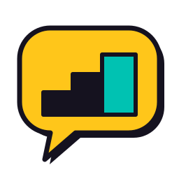
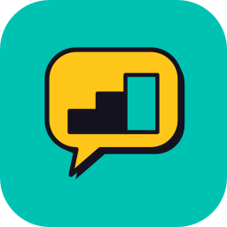
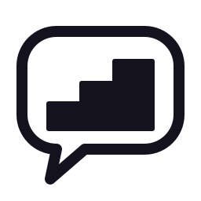
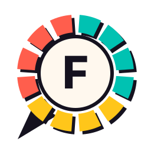
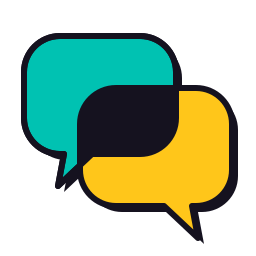
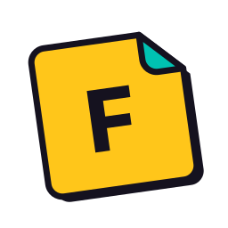
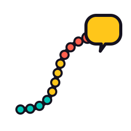
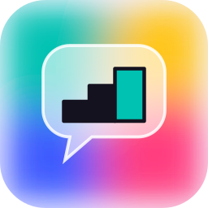

# Logo concepts

Six directions for the app's mark, with a recommendation. Each is sketched in
[`concepts/`](concepts/) as an SVG on a 256 × 256 grid. The sketches show the
idea, the proportions and the colours; they are not finished artwork. A
designer takes the chosen one to final. Where a sketch shows a letter (B, D),
it is the initial of the recommended name, Fluentladder, and it follows
whichever name is chosen. Concepts A, C, E and F carry no letter, so they fit
any name.

The concepts start from what the app already has. The splash artboard
(`deutsch-plan-design-html/android-light/screens/Splash-android.html`) shows
the current mark: a **"D" in a Sun speech bubble**, 120 × 92 with a 28 corner
radius, a 3 px ink outline and a 3 px hard offset shadow, on a **Lagoon**
screen, with the wordmark in Inter Bold. That "Paper & Ink" style is the
app's own: solid saturated fills, ink outlines, hard shadows, no gradients.
The big language apps' marks are soft and rounded, with no ink outline (a
general impression, not a survey), so it also sets the app apart. The
concepts keep it and drop the "D", which only works for German.

**Today the app ships Flutter's default launcher icon** (`app/android/app/src/main/res/mipmap-*/ic_launcher.png`). The logo work fills that gap, and it must land before the first Play upload.

## The palette the marks use

All colours are the app's own tokens (`docs/01-architecture/theming.md`), so
the icon, the splash and the app are one family.

| Token | Hex | Role in the mark |
|---|---|---|
| Sun | `#FFC61A` | The main fill: warm, optimistic, the colour of "learning" in the app |
| Lagoon | `#00C2B2` | The ground: the icon background and the splash; also "good" and progress |
| Ink | `#15121F` | Outline, shadow, the symbol inside |
| Paper | `#FFF8EE` | Light backgrounds, the ring's centre |
| Coral | `#FF5E4D` | The C band in concepts B and E |
| Cobalt, Raspberry | `#3D5AFE`, `#FF3D7F` | Only in the aurora-glass version (F) |

The app uses Cobalt, Raspberry and Emerald for der, die and das. Those are
German-specific, so the mark doesn't lean on them.

## A. The step bubble (recommended)

  

**The idea.** The current Sun speech bubble, with a **three-step staircase**
inside in place of the "D". The top step, the goal, is Lagoon. It says: you
climb, step by step, until you can speak. The bubble is the speaking; the
steps are the course (the app calls its levels "steps", ধাপ in Bangla).

**Construction** (on the 256 grid):
- **The bubble:** a rounded rectangle 200 × 150 with a 44 corner radius, and a tail at the bottom left pointing down-left, as in today's mark.
- **The outline and shadow:** a 7 px ink outline with round joins, and the same shape offset by 7, 7 in ink as the hard shadow.
- **The staircase:** three steps on a common base, rising left to right: two ink steps 42 wide and 32 and 58 high, then the top step, the goal, 48 wide and 86 high, in Lagoon with an ink outline. Each rise is 26–32.
- **Proportion:** the staircase spans about 66 % of the bubble's width and is centred slightly low, so the bubble reads first.

**Why it's first.**
- It keeps the equity the app already has (Sun bubble, ink outline, hard shadow, Lagoon ground) and drops the one German-specific element.
- It carries the product: a course of steps that leads to speaking.
- It works for every future language pair and every name on the shortlist. A "step" name makes the fit exact.
- It survives 24 px (see "At small sizes").

**Watch:** three rising bars alone read as a phone's signal-strength icon.
That is why they are joined into one staircase on a shared base, with a
different top step. Keep them joined.

## B. The twelve-step ring

**The idea.** A ring of **12 segments**, one per step from A1.1 to C2.2,
coloured by CEFR band: A in Lagoon, B in Sun, C in Coral. A speech tail sits at
7 o'clock and the name's initial is in the centre. It is also the app's own
progress ring on Today, so the splash can shrink the mark into Today's ring as
the spec already asks ("Mark shrinks toward Today's ring position"). The mark
becomes the progress.

**Construction.** Segments 30° apart with 8° gaps, stroke 30 on radius 84.
A Paper centre of radius 62 with a 6 px ink outline. The initial in Inter
ExtraBold at about 76. The hard shadow is the ring offset by 5, 5.

**Strengths:** the most "course-like" of the six; a clock face also says "daily".
**Risks:** busy under 32 px, where the segments merge into a colour wheel;
it needs the initial, so it is tied to the name; 12 is German-course-specific
if another language gets a different number of steps.
**Best use:** the splash animation and the course screen, beside a simpler app icon.

## C. Two bubbles, one bridge

**The idea.** Two speech bubbles overlap: the Lagoon one behind is the
learner's own language, and the Sun one in front is the language they learn.
Where they overlap, in ink, is the **meaning**, the place where the two
languages meet. Their tails point opposite ways, like a conversation. This is
the app's "meaning language" idea as a picture, and it carries every future
pair: Bangla → German, Hindi → French, Arabic → English.

**Construction.** Two bubbles of 152 × 118 with a 36 radius, offset
diagonally by 56, 52. A 6 px ink outline and a 6, 6 hard shadow. The overlap
is filled ink with a clip path.

**Strengths:** the clearest picture of "two languages" and "meanings in yours".
**Risks:** two overlapping bubbles are the standard chat-app icon (Google
Chat, many messengers). The ink overlap and the hard shadow are what keep it
from looking like one. It is harder to make a monochrome icon.
**Best use:** marketing and the store feature graphic, where the letters in
the bubbles can change by market: অ and A, अ and Ä, ا and B.

## D. The flip card

**The idea.** A word card, tilted 8°, with its top-right corner folded over
to show a second colour underneath. The card is the flashcard at the heart of
spaced repetition; the fold is the moment of recall, when the meaning shows.
The name's initial sits on the front.

**Construction.** The card is 168 × 168 with 16 radius corners, except the
folded one. The fold is a 44 triangle in Lagoon. A 7 px ink outline, a 7, 7
shadow, rotated −8°.

**Strengths:** the core mechanic, instantly; the fold survives 24 px well.
**Risks:** a folded page is also the generic "document" or "notes" icon, and
the tilt and the Sun colour have to work hard against that. It says "cards",
not "course" or "speaking".
**Best use:** an in-app illustration (the revision screen, the empty states),
or as the app icon if the name carries "course" and "speaking" on its own.

## E. The path of twelve stops

**The idea.** A road climbing from bottom left to top right, with twelve
stops along it (four Lagoon, four Sun, four Coral: the bands) and a small Sun
speech bubble at the end. It is the course as a journey, and the "path" and
"way" names drawn literally.

**Construction.** One cubic curve, a 10 px ink stroke with round caps. Twelve
stops of radius 8 spaced evenly by arc length, the last one larger. The end
bubble is 68 × 56.

**Strengths:** tells the whole story (start, twelve steps, the goal is to speak); lovely as a banner.
**Risks:** too fine for an app icon; the dots vanish under 48 px. It is wide rather than square.
**Best use:** the store feature graphic, onboarding, and the progress screen's header.

## F. Aurora glass

**The idea.** Concept A's bubble and staircase, frosted, over the app's aurora
backdrop: blurred blobs of Lagoon, Sun, Raspberry and Cobalt, as behind the
glass theme. It is the premium, modern face of the same mark, for the glass
theme's users and for a future paid tier.

**Construction.** The blobs are circles of radius 80–90, blurred by 26. The
bubble is white at 60 % with an 85 % white outline, which stands in for glass
(a real icon uses a pre-rendered blur). The staircase stays ink with its
Lagoon top step.

**Strengths:** beautiful at large sizes; matches the glass design.
**Risks:**
- gradients and blur don't make a monochrome or notification icon;
- it softens the "Paper & Ink" identity;
- it dates faster than flat marks.
**Best use:** as an alternative icon or seasonal variant, never the only one.

## The recommendation

1. **The app icon and the main mark: A, the step bubble.** On a Lagoon ground, with the Sun bubble and ink staircase.
2. **The splash motion: B's ring.** The bubble shrinks into Today's ring, which fills with the band colours.
3. **Marketing:** C for "your language, their language", and E for the journey.
4. **In the app:** D as the illustration style of the revision screens.
5. **F**, only if a premium tier or an alternative-icon option appears.

## The mark as a system

**The wordmark.**
- Inter (already bundled), ExtraBold or Bold, letter spacing −0.5 at 28 px, as the splash has it, in ink on light and paper on dark.
- A two-part name can colour its second part Lagoon (for example "Fluent" in ink and "ladder" in Lagoon), but only in marketing. In the app bar it stays one colour.
- **In Bangla,** the name is lettered in Noto Sans Bengali Bold, the app's Bangla face, by a native designer, and used on the bn-BD store listing.

**The lockups.**
- Horizontal: the mark at the cap height times 1.6, then the wordmark.
- Stacked: the mark over the wordmark, as on the splash.
- Clear space: the height of the staircase's first step on every side.

**Course badges for more languages.**
- A course is the mark plus a small chip with the language's **ISO 639-1 code**: DE, FR, ES, EN, JA.
- **Never a flag.** A language is not a country: German is spoken in Germany, Austria and Switzerland, and English learners come from everywhere.
- Each course can take one palette colour for its chip: German Sun (the current), English Lagoon, French Cobalt, Spanish Coral, Japanese Raspberry.
- The meaning language shows as text ("in Bangla", "বাংলায়"), never as a symbol.

## The icon specifications (Android first)

| Asset | Size and rules | What goes in it |
|---|---|---|
| Adaptive launcher icon | Two layers, 108 × 108 dp each. The launcher masks them to a circle, a squircle or a rounded square, and only the centre 72 dp is always visible. Keep the art inside the **66 dp safe circle**. | Foreground: the step bubble. Background: flat Lagoon `#00C2B2`. |
| Themed (monochrome) icon | Android 13+: one layer, one colour, which the system tints. | A's outline and staircase (`a-step-bubble-mono.svg`), with no shadow and no fill. |
| Notification icon | 24 × 24 dp, white on transparent, silhouette only (Android draws it in one colour). | The bubble outline with the staircase; drop the shadow. |
| Splash (Android 12+) | The icon at 240 × 240 dp, with the art inside the central 160 dp circle, on the window background. | The step bubble on Lagoon, identical to Flutter's first frame (FR-S1-01's "no visible hand-off"). |
| Play Store icon | 512 × 512 PNG, 32-bit, square: **Play rounds the corners itself**. Don't add a drop shadow to the icon's shape. The mark's own offset shadow is part of the drawing. | The launcher icon, full bleed, with the Lagoon ground. |
| Play feature graphic | 1024 × 500. | Concept E's path across, the mark and the name, and the tagline. |
| Home-screen widget preview | The widget's own preview image; today it is also Flutter's default. | The widget as it looks, with the mark in its corner. |
| iOS (later) | 1024 × 1024, no transparency, no rounded corners; the dark and tinted variants iOS 18 asks for. | The same, from the SVG master. |

Build every asset from one **SVG master** on a 1024 grid. Android Studio's
Image Asset tool makes the adaptive and legacy mipmaps. A package such as
`flutter_launcher_icons` would be a new dependency: it needs the `pubspec`
lock and a licence entry.

## At small sizes

The contact sheet renders each concept at 200, 48 and 24 px. Down at 24 px:

- **A** still reads: a yellow bubble with a staircase.
- **D** still reads: a card with a fold.
- **B** becomes a colour wheel.
- **E** becomes a squiggle.

That is why A is the icon and B and E are for large sizes. Re-run the check
on a real phone at 100 % and 200 % display size, in the light and dark
launcher themes, before choosing.

## Next steps

1. The owner picks a name ([`README.md`](README.md)) and a direction here.
2. A designer takes the chosen concept to final artwork: the SVG master, the wordmark in Latin and Bangla, the colour and monochrome versions.
3. One issue then replaces the launcher icon, the adaptive and monochrome layers, the notification icon, the splash mark and the widget preview, and updates the store assets. That lands with the new name before the first Play upload.
