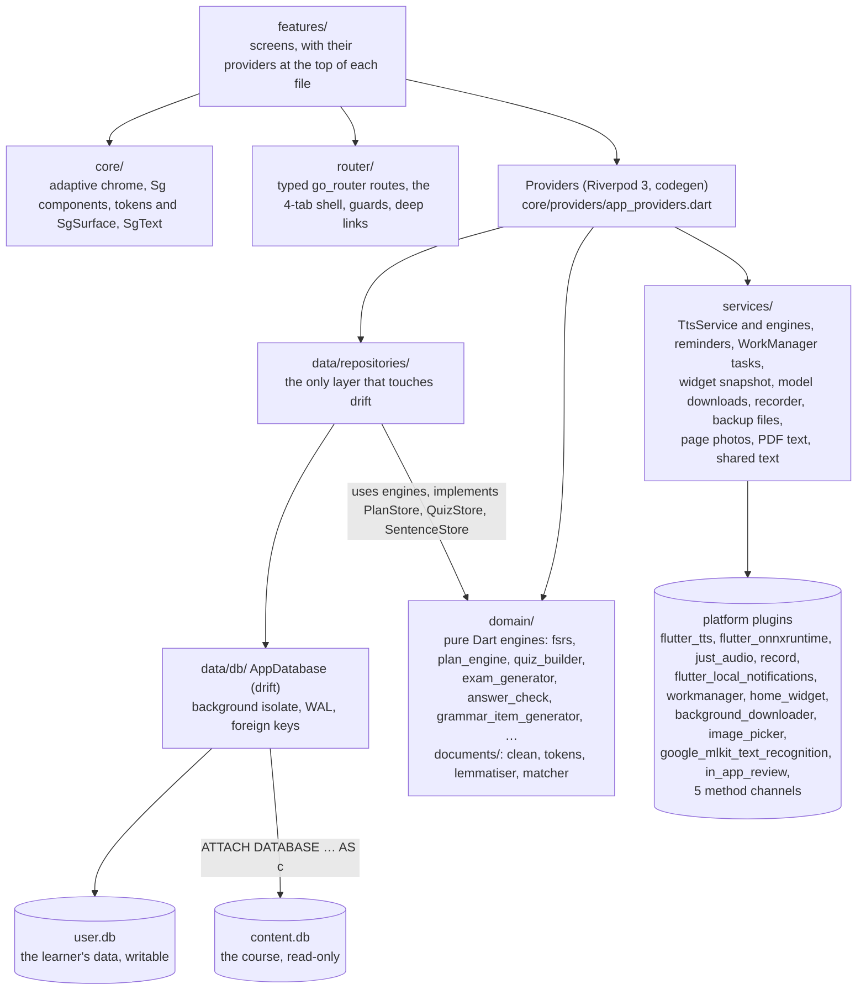
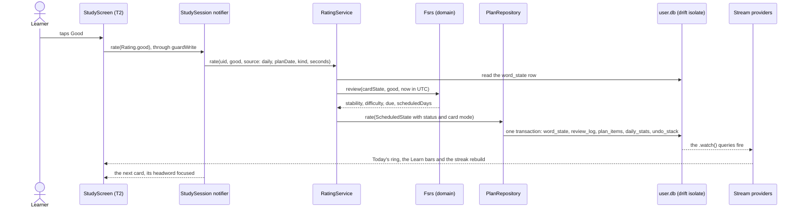
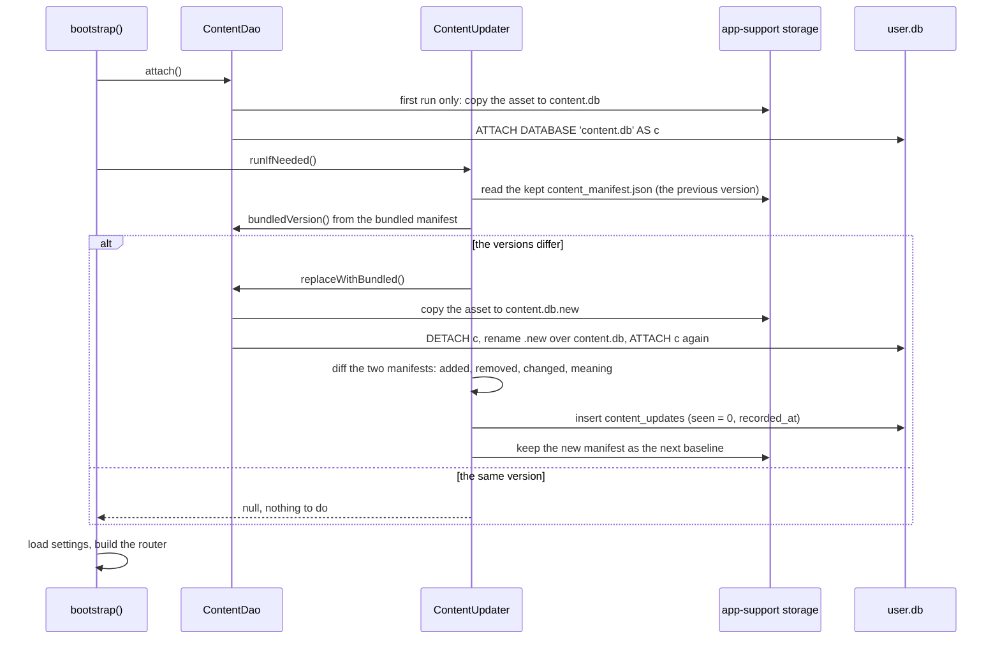
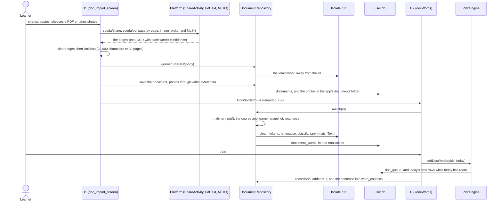

# 4. Architecture

Sogda is one Flutter package (`app/`, package `sogda`) built in
layers. Screens render state from Riverpod providers. Providers wrap
repositories. Repositories are the only code that touches drift, which holds
two SQLite files: the learner's `user.db` and the read-only course `content.db`,
attached to it as schema `c`. The rules of the course (scheduling, planning,
quizzes, exams, answer checking, and since v1.2.0 the document matcher) live
in pure-Dart engines under `domain/`, and platform features (voice,
reminders, background work, the widget, model downloads, and a document's
share, PDF and photos) sit behind small interfaces under `services/`. A test,
`app/test/architecture_test.dart`, enforces the layering mechanically. This
chapter explains the layers, startup, state, data, navigation, theming,
typography, localisation and platform integration, with the reasons behind
each rule.

> The detailed specs in [`docs/`](../README.md) win if anything here
> disagrees with them: [`01-architecture/`](../01-architecture/) for how the
> app is built, [`02-data/`](../02-data/) for the databases and
> [`03-domain/`](../03-domain/) for the engines.

## The layers

What each layer is, and the rule that keeps it that way:

| Layer | Folder | What it holds | The rule, and why |
|---|---|---|---|
| Features | `app/lib/features/<group>/` | One folder per screen group: `backlog`, `bootstrap`, `day_complete`, `documents` (D1–D3, v1.2.0), `exam`, `learn`, `me`, `onboarding`, `quiz`, `search`, `sentences`, `splash`, `study`, `today`, `words` | Widgets read providers and act through notifiers, services, or a repository's provider in an event handler; they never build a repository, import drift, or run a query in `build()`. A screen's providers sit at the top of its own file (Today's are in `today_providers.dart`). |
| Core | `app/lib/core/` | `adaptive/` (all platform chrome), `components/` (the Sg widgets), `providers/` (every repository and service provider), `theme/` (tokens, `SgSurface`, aurora, glass), `typography/` (`SgText`) | Shared by every screen, so a change here re-renders other screens' goldens (the `shared-look` lock, [06-quality](06-quality.md)). |
| Router | `app/lib/router/` | `routes.dart` (typed routes, args, `open`/`instead` helpers), `app_router.dart`, `app_shell.dart`, `cross_tab.dart`, `route_guards.dart`, `back_behaviour.dart`, `deep_links.dart` | Navigation outside this folder uses the typed routes, their helpers or `context.jumpToTab`: no inline paths, so every destination is a route the tests can see. |
| Data | `app/lib/data/db/`, `app/lib/data/repositories/` | `AppDatabase`, the `.drift` files, `ContentDao`, `ContentUpdater`; repositories and services such as `PlanRepository`, `RatingService`, `ExamRepository`, `SearchRepository`, `SettingsRepository`, `DocumentRepository` | The only layer that imports drift. Nothing writes to the course tables (ADR 26). |
| Domain | `app/lib/domain/` | The engines, as pure functions and small classes, with interfaces for what they need from storage (`PlanStore`, `QuizStore`, `SentenceStore`); `documents/` holds the matcher's pipeline and `withoutMetadata` | Imports nothing from Flutter, drift, Riverpod, go_router, any plugin, `dart:io` or the app's other layers, so every engine is unit-testable with plain Dart and a fake clock. |
| Services | `app/lib/services/` | `tts/` (`TtsEngine`, `SystemTts`, `SupertonicTts`, `TtsService`), `translation/` (`Translator`), `model_downloads`, `reminder_notifications`, `background_tasks`, `widget_snapshot`, `exam_recorder`, `backup_files`, `device_storage`, `notification_permission`, `start_report`; for documents `shared_text`, `pdf_text` and `page_photos`; `play_review` | Each plugin sits behind a small interface with a `Platform…` implementation, so widget tests pass a fake (`test/services/fake_tts.dart`). |
| Copy | `app/lib/l10n/` | `app_en.arb` (the template, with descriptions), `app_bn.arb`, `ui_digits.dart` | Every user-facing string is an ARB key; German course text comes from content.db, never from ARB. |

`architecture_test.dart` holds these rules (the full list is in
[06-quality](06-quality.md#the-architecture-test)): no
`package:flutter/material.dart` or `cupertino.dart`, a pure `domain/`, drift
only in `data/`, no raw colours outside `core/theme/`, no Material or
Cupertino chrome outside `core/adaptive/`, no writes to content tables, no I/O
in `build()`, `DateTime.now()` only through `clockProvider`, typed navigation
only, text only through `SgText`, and keepAlive providers only where
`state-management.md` lists them.

## Startup

Startup is `main()` and `bootstrap()` (`app/lib/main.dart`,
`app/lib/bootstrap.dart`), specified by [`splash.md`](../04-screens/splash.md)
(FR-S1-01 to -03).

1. `main()` sets edge-to-edge system bars and calls
   `runApp(const ProviderScope(child: BootstrapHost()))` straight away, so S1
   (the splash) draws while the disk work runs. S1 needs only a theme; it
   follows the platform's brightness until settings are read.
2. `BootstrapHost` starts `OrientationLock` (a phone stays portrait, a tablet
   of 600 dp or more turns, #577) and runs `bootstrap()`.
3. `bootstrap()` does all startup I/O, in order, and never throws:
   - opens user.db (`AppDatabase.open`, creating the schema or migrating it)
     and forces the open with `PRAGMA user_version`;
   - peeks `ui_language` so the splash can switch language early;
   - installs the course: `ContentDao.attach()` copies the bundled asset on a
     first run and attaches it as `c`, then `ContentUpdater.runIfNeeded()`
     replaces it when the bundled `content_version` differs (see the sequence
     below);
   - loads every setting into memory (`SettingsRepository.load()`);
   - asks the platform whether glass can blur (`GlassCapability`, bounded to
     150 ms);
   - builds the one `GoRouter`, starting at `/today` for an enrolled learner
     and at S2 page 1 otherwise, with the route guards.
4. The result is `BootstrapReady` (with the provider overrides for
   `appDatabaseProvider` and `settingsProvider`) or `BootstrapFailed` (with the
   step that failed and the database if it opened). A failure shows FR-S1-03's
   error screen, with *Retry* (a content failure deletes the installed copy
   first, unless it still reads, #617) and, when the database opened,
   *Export progress*.
5. On success `main` builds a `ProviderContainer` from the overrides, then
   starts the reminders and background tasks (`startReminders`), the widget
   snapshot (`followWidget`), the model download manager
   (`modelDownloadsProvider.attach()`) and the voice's memory
   (`watchVoiceMemory`: Supertonic's sessions close in the background and
   under memory pressure, #638, #906), and the documents older than M3's
   *Auto-delete documents* go, after the start and never in its way
   (`deleteOldDocuments`, FR-D3-03); all of it in `wireApp`. A *Retry*
   that works goes the same way, in a new container (#643). `SogdaApp` is a
   `MaterialApp.router` whose theme, locale and theme mode are watched from
   providers.

The cold-start budget is under 1.5 s to Today on a mid-range phone. The app
reports Android's "Fully drawn" once Today shows its plan (the
`sogda/start` channel calls `reportFullyDrawn()`), so `tools/perf.py`
measures the real time to Today rather than the splash frame
([`accessibility-performance.md`](../01-architecture/accessibility-performance.md)).

## State

State management is Riverpod 3, with code generation only
([`state-management.md`](../01-architecture/state-management.md)).

- Providers are declared with `@riverpod` or `@Riverpod(keepAlive: true)` and a
  `part 'x.g.dart'`, generated as `xProvider`. `riverpod_lint` runs as an
  analyser plugin, which is why the lint command is `dart analyze`, never
  `flutter analyze` (ADR 18).
- **The database is the source of truth.** Anything the UI watches is a
  `Stream` provider over a drift `.watch()` query, so a rating in a study
  session updates Today's ring, the Learn bars and the streak with no manual
  invalidation. One-shot and derived values are `Future` providers.
- **Auto-dispose by default.** keepAlive is reserved for what must outlive a
  screen, and `architecture_test.dart` holds the set to the doc's list: in
  `app_providers.dart` `appDatabase`, `settings`, `clock`, `theme`,
  `languages`, `modelRepository`, `systemTts`, `supertonicTts`,
  `supertonicVoice`, `tts`, `notificationPermission` and `modelDownloads`; in
  features, `studySession` (the session queue survives backgrounding) and
  `onboarding` (S2's draft survives its pages coming and going).
- **One clock.** `clockProvider` is a `DateTime Function()` and the only
  source of "now"; `todayProvider` derives the local date string from it. It
  does not tick: Today re-reads it on resume and on pull-to-refresh, and
  `todayPlan` watches it, so a new date re-runs `PlanEngine.openDay`.
- **Settings are synchronous.** `SettingsRepository` reads the `settings`
  table once and serves typed values (`SettingKeys`) from memory, because a
  theme or a language is read during `build`. A write persists and fires a
  change that providers follow.
- **Actions are notifier methods** (`ref.read(studySessionProvider.notifier).rate(…)`);
  a one-off write may also run in an event handler through the repository's
  provider, never in `build()`. A failed answer write goes through
  `guardWrite` (`features/study/write_guard.dart`): the card stays, and a sheet
  offers *Retry* and *Export progress* (#174).
- Drift row classes can't be provider return types, so they are wrapped in a
  class or a record (`WordWithState`, `StepWord`, `CategoryProgress`).

Rating a card shows the whole loop, from a tap to every screen that depends on
the result:

The status (learning or done) follows `done_stability_days`; two consecutive
Good or Easy ratings switch the card to cloze unless the learner chose its
mode (BR-FSRS-06); *Undo* restores the previous `word_state` row and deletes
the log entry in one transaction.

## Data

Two databases, by design (ADR 2): content updates must never touch progress.

- **user.db** is created from `app/lib/data/db/user_schema.drift`, which is
  both the DDL and the source drift generates typed tables from (ADR 22). It
  lives in app-support storage and opens on a background isolate
  (`DriftNativeOptions(shareAcrossIsolates: true)`), so writes stay off the UI
  isolate. Every connection sets `journal_mode = WAL`, `foreign_keys = ON` and
  `busy_timeout = 5000` (`configureConnection`). The schema version is
  `PRAGMA user_version` (ADR 23), now 6: v4 recorded how an enrolment ended
  (#1047), v5 an exam's meaning language (#1120), and v6 added the
  documents' four tables and `custom_words.mt` (#1226).
- **content.db** is the compiled course, bundled at
  `app/assets/db/content.db`, copied to app-support storage and attached by
  plain path as schema `c` (ADR 26). drift generates nothing for an attached
  database, so `ContentDao` runs hand-written SELECTs from `content.drift`,
  type-checked against `content_schema.drift` (a mirror of the pipeline's
  DDL). It is read-only by construction: the content queries are SELECTs only,
  and the architecture test fails on any write to a content table.
- `AppDatabase.allSchemaEntities` filters to `ownTables`, so drift never
  creates an empty `words` table in user.db that would shadow `c.words`.
- Writes use drift's typed API or `customUpdate(…, updates: {…})`. A bare
  `customStatement` would leave every watcher stale.
- Plan dates are local `YYYY-MM-DD` strings (a study day is a local day);
  timestamps are UTC ISO-8601.

A content update happens at launch, inside `bootstrap()`, before any screen
can read the course:

Progress is keyed by word uid, so it survives, and a word whose uid changed
takes it along: the manifest's `aliases` map each old uid to the new one and
the updater moves the rows first (PIPE-09). A removed word keeps its
`word_state` rows, but plan generation and queries join to `c.words`, so it
disappears from the app without being deleted. Today shows one update card
while `seen = 0`, and words whose meaning changed wear an *Updated* chip for 7
days (BR-CONTENT-02, -03). The manifest is saved last, so an update
interrupted at launch simply runs again next time
([`content-database.md`](../02-data/content-database.md)).

## Documents (v1.2.0)

A document goes from a page to words in two screens and one repository
([`document-matcher.md`](../03-domain/document-matcher.md)). D1 gets the
text and saves it; D2 matches it and adds what the learner chooses. The
heavy work runs off the UI isolate twice: the German check before the save,
and the matcher on every opening of D2.

- **The domain** (`domain/documents/`) is pure Dart, as every engine is:
  `clean.dart`, `tokens.dart` (sentences, words, names, the German check),
  `lemmatiser.dart` with `strong_verbs.dart`, `stop_words.dart`,
  `matcher.dart`, `ocr.dart` (a photographed page and its confidence) and
  `photo_privacy.dart` (`withoutMetadata`). The lemmatiser is built from the
  course's own `words.forms` plus rules; no dictionary comes from outside.
- **The isolate.** `DocumentRepository.match` reads one snapshot of the
  course and the learner (`matcherInput`: each word's step, level and
  `freq`, the statuses, the uids any plan has held, *My words*' keys, the
  active step) and hands it to `Isolate.run`, where the lemmatiser builds its
  index. Nothing in the isolate touches drift.
- **The plan side** stays in `PlanEngine` (BR-PLAN-11): `addDocWords` queues
  the words and answers each one's first day, `plannedToday` and
  `docSlotsLeft` say what today holds, and `openDay` takes the queue's share
  under the cap the day opened with (`planned_doc_cap`).
- **The routes** are one stack in the Search tab, so a row's D2 and *New
  document*'s D1 come back to D3 (below).
- **Privacy** sits below the screens: `DocumentRepository.saveImages`
  writes only what `withoutMetadata` returns, and the services delete the
  picker's and a share's copies of a photo or a PDF once they are read
  (`page_photos.dart`, `pdf_text.dart`; BR-DOC-05).

## Navigation

Navigation is go_router 18 with typed routes generated by `go_router_builder`
([`navigation.md`](../01-architecture/navigation.md), ADR 5).

- **Four tabs** under a `StatefulShellRoute.indexedStack` (`AppShellRoute`):
  Today (`/today`), Learn (`/learn`), Search (`/search`) and Me (`/me`). Tabs
  keep their state; a re-tap scrolls to the top, and a second re-tap pops to
  the root.
- **Full-screen tasks** (`/study`, `/sentences`, `/day-complete`,
  `/grammar-practice`, `/quiz`, `/exam/:attemptId`) are declared outside the
  shell, on the root navigator, so they cover the tab bar and close back to
  their opener. Modals never switch tabs.
- **The document screens** (v1.2.0) are in the Search tab's stack: D1
  `/search/import`, D2 `/search/document/:id` (with `?cut=` for D1's note,
  #1320) and D3 `/search/documents`. D1's end replaces it with D2
  (`DocWordsRoute.instead`), so back returns to R1; D3's row pushes D2
  (`DocWordsRoute.open`), so back returns to D3. Me's *My documents* is a
  cross-tab jump to D3.
- **Helpers.** A route is opened with its static `open` (push) or `instead`
  (replace) helper: `StudyRoute.open(context, SessionArgs)`,
  `QuizRoute.open(context, QuizArgs)`, `ExamRoute.open(context, attemptId)`.
  A destination in another tab uses `context.jumpToTab(Route(…))`
  (`cross_tab.dart`), which switches the branch and builds the target tab's
  parents, so back walks them.
- **Arguments.** Ephemeral session data (which cards) travels as `extra`;
  anything that must survive process death, such as an exam attempt, is an id
  in the path.
- **Guards** (`route_guards.dart`): `/exam/*` and `/study` need an existing
  attempt or session, and `/onboarding/*` sends an enrolled learner to Today.
- **Back.** Android back pops, returns to Today from another tab root, and
  exits from Today; predictive back is on (`enableOnBackInvokedCallback`). iOS
  has the edge swipe on pushed routes.
- **Deep links** use the private `sogda://` scheme only:
  `sogda://today`, `…/learn/A2.1`, `…/word/<uid>?speak=1`,
  `…/exam/A1.2` and `…/import`. `resolveDeepLink` maps each to a location (the exam link opens
  the step's exams tab, not the runner). The reminder notification, the
  widget and Android's share sheet are the only senders, and a running exam is
  never interrupted by one: a share held there says so in a toast (#1282).
  Each share is numbered (`?arrival=`), so a second one onto D1 is read too.
- **Sheets and panes.** W1 (word detail) is shown over its opener without
  navigating: `WordRoute.open` calls `showWordDetail`, a sheet with medium and
  large detents on a phone (`Adaptive.showSheet`) and a right-hand pane on a
  tablet whose shortest side is 600 dp or more (`Adaptive.showPane`). The
  route `/word/:uid` is the deep link's full page.

`app_router_test.dart` parses the route table in `navigation.md`, so a new
route means a new row there in the same PR.

## Theming

Three modes share one layout and one component set; only tokens and the
surface renderer differ ([`theming.md`](../01-architecture/theming.md), ADR 11).

| Mode | Name | Character |
|---|---|---|
| Light | Paper & Ink | Cream paper, near-black ink, solid fills, hard 3 px offset shadows |
| Dark | Night Ink | Violet-black paper, light ink, the same fills lifted one step |
| Glass | Aurora Glass | Drifting colour blobs behind frosted translucent panels; buttons stay solid. A smoked dark variant follows the system's dark mode |

- **Tokens.** `AppTheme` exposes one `SgTokens` (`ThemeExtension`) per mode:
  colour, surface, typography, shape, spacing and motion. Widgets read
  `context.tokens`, never hex; a raw `Color(0x…)` outside `core/theme/` fails
  the architecture test. The gender colours (der, die, das) and verdict
  colours are fixed tokens, which is why there is no dynamic Material You
  colour (ADR 12). Material's `ColorScheme` fields are pinned too (ADR 21).
- **One surface.** Every card, sheet, header and bar is a
  `SgSurface(kind:)`, with kinds `card`, `cardStrong`, `bar` and `tint(colour)`.
  In light and dark it is a filled box with an outline and offset shadow; in
  glass it is a clipped `BackdropFilter` with a border and top highlight.
  Adding glass changed no screen file.
- **Glass budget and fallback.** At most three blur layers on screen (header,
  one panel, tab bar), so scrolling lists use `SgSurfaceKind.bar`.
  `GlassCapability` falls back to a 92 %-opaque tint below Android 12 (API
  31), after 2 s of missed frame budgets, or when the OS asks to reduce
  transparency. `AuroraBackdrop` drifts its blobs on 18–24 s loops, with the
  leading blob in the current tab's colour.
- **Contrast.** WCAG 2.2 AA in every mode, measured over the tokens by
  `test/core/theme/contrast_test.dart`; glass has its own darkened text
  palette, and progress tracks use `surface.track` for 3:1 (#437).
- **Reduce motion** gives cross-fades, no shake, no confetti and no aurora
  drift, read live from `MediaQuery.disableAnimationsOf`; iOS's Reduce Motion
  is folded into it at the app root (`stillOnReduceMotion`).

## Adaptive chrome

Flutter 3.47 moved Material and Cupertino into the standalone packages
`material_ui` and `cupertino_ui`, and the in-SDK libraries are deprecated. The
app started on the packages (ADR 6), so no file imports
`package:flutter/material.dart` or `cupertino.dart`.

All platform chrome goes through `app/lib/core/adaptive/adaptive.dart`:
Material 3 on Android and Cupertino on iOS (`AdaptiveChrome`), with identical
content components on both.

| Instead of | Use |
|---|---|
| `Scaffold`, `AppBar` | `AdaptiveScaffold` (with `AdaptiveBackButton`) |
| `Switch`, `SegmentedButton`, `TabBar` | `AdaptiveSwitch`, `AdaptiveSegmented`, `AdaptiveTabBar`; the shell uses `AdaptiveNavBar` |
| `showModalBottomSheet`, `AlertDialog`, `showTimePicker` | `Adaptive.showSheet`, `Adaptive.showPane`, `Adaptive.showConfirm`, `Adaptive.showTypedConfirm`, `Adaptive.showTimePickerFor` |
| `FilledButton`, `ElevatedButton`, `OutlinedButton`, `TextButton` | `SgButton` (primary, secondary, text) |
| `Chip`, `ActionChip`, `FilterChip` | `SgChip` (step, status, filter, streak, webLink) |

The same file provides `AdaptiveRefresh`, `AdaptiveTooltip` (an icon-only
control shows its name on a long press under Material chrome),
`AdaptiveTapTarget` (grows a small control's hit area and semantics node to
48 dp, or 44 pt under iOS chrome, without growing its layout) and
`AdaptiveToastScope`. A deliberate exception is marked
`// ponytail: allow-chrome`.

## Typography

Inter (Latin) and Noto Sans Bengali are bundled as variable fonts; every
style falls back to Noto Sans Bengali, because Inter has no Bangla glyphs
(`core/typography/app_fonts.dart`). Text is always drawn through
`core/typography/sg_text.dart`, never `Text`:

- `SgText(role:)` for copy, on the scale display 40 · headline 28 · title 20 ·
  bodyLarge 17 · body 15 · label 13 · caption 12. **Bangla runs are set one
  role larger** than the German or English beside them, per run, so a mixed
  string ("die Wohnung · ফ্ল্যাট") reads evenly.
- `SgHeadword` draws a German headword in its article's colour; `SgOneLine`
  cuts a title after its last whole word with "…" (inside the first word when
  not even that fits, #746); `SgRuns` and
  `SgGermanRuns` draw runs in their own styles and voices.
- **Screen-reader languages.** German spans are tagged `de-DE` and Bangla
  `bn-BD` (`SgScript.spans`), so TalkBack and VoiceOver switch voices
  mid-string. The app's own copy is untagged.
- **Breaking long words.** German compounds break at syllables, by German's
  syllable rule rather than a dictionary (`SgScript.allowBreaks`, soft
  hyphens), only above 100 % text or when a word is wider than its line, and
  the line shows its "-" (`_Hyphenated`, since Flutter draws none at a soft
  hyphen). A Bangla word wider than its line first shrinks to 80 % in a run of
  its own (`SgScript.banglaShrink`) and only then breaks between aksharas
  (`SgScript.banglaBreaks`), never inside a conjunct and with no "-" (the
  owner's call, #522).
- **Large text.** Up to 200 % on every screen. Past 130 % (`SgScript.large`)
  side-by-side layouts stack; a fixed box grows by its text's factor with
  `SgScript.grow`, never `textScaler.scale(n)`, because Android 14+ scales text
  nonlinearly ([`accessibility-performance.md`](../01-architecture/accessibility-performance.md)).

## Localisation

- **Four UI languages**, English, Bangla, Polish and Russian, in `app_en.arb`
  (the template, where every key has an `@key` description naming its
  screen), `app_bn.arb`, `app_pl.arb` (#1078) and `app_ru.arb` (#1079). `flutter pub get` generates
  `AppLocalizations` into `lib/l10n/generated/` (gitignored).
- **The UI language and the meaning language are separate settings**
  (`ui_language` = en, bn, pl or ru; `meaning_primary` and an optional
  `meaning_secondary`, codes of the course's languages, #1081). S2's
  page 1 sets the app language, page 2 the meaning; Settings changes each
  alone. A first run starts in the phone's language when Sogda speaks it. The locale comes from `ui_language`, not
  the device.
- `appLocalizationsDelegates` in `main.dart` must be used by every
  `MaterialApp`, because `material_ui` and `cupertino_ui` look up their own
  localisation types; gen_l10n's default list left Bangla without them.
- **Bangla digits.** Every number in Bangla UI text is in Bangla digits (#425):
  an `int` placeholder is `decimalPattern`-formatted, and a number the code
  writes itself goes through `l10n.digits` (`lib/l10n/ui_digits.dart`). German
  content keeps its own digits, and Today's date is always German on purpose.
- Category names are course content and stay English in both UI languages
  (owner, #425).

## Platform integration

| Feature | How | Where |
|---|---|---|
| Home-screen widget | The app writes a JSON snapshot (step, remaining, total, minutes, word of the day, tomorrow, and its copy in the UI language) to `home_widget`'s store; a Glance widget draws it in two responsive sizes | `services/widget_snapshot.dart`, `android/…/widget/SogdaWidget.kt`, [`notifications-widget.md`](../03-domain/notifications-widget.md) |
| Daily reminder | `flutter_local_notifications`, one inexact alarm per study day for the week ahead, rescheduled after a reboot; permission asked only when the reminder is switched on | `data/repositories/reminder_scheduler.dart`, `services/reminder_notifications.dart` |
| Background work | WorkManager unique work: `plan_pregenerate` (00:05, opens the day), `reminder_compose` (10 minutes before the reminder, writes or cancels its text) and `widget_refresh` (hourly, while a widget is placed). Each opens user.db on its own connection | `services/background_tasks.dart`, `services/background_work.dart` |
| Model downloads | `background_downloader`: resumable, Wi-Fi-only by default, a progress notification, checksum-verified before use | `services/model_downloads.dart`, `data/repositories/model_repository.dart`, `assets/models/manifest.json` |
| Voice | `SystemTts` (flutter_tts, `de-DE`) and `SupertonicTts` (ONNX Runtime, four sessions, clips cached on disk), chosen by `TtsService` with a fallback | `services/tts/`, [`tts.md`](../03-domain/tts.md) |
| Speaking exam | `record` for the recording, `just_audio` for playback | `services/exam_recorder.dart` |
| Export and import | `share_plus` and `file_picker` | `services/backup_files.dart`, `data/repositories/backup_repository.dart` |
| Share → Sogda (v1.2.0) | `ShareActivity`, with no window of its own, holds the `ACTION_SEND` / `ACTION_SEND_MULTIPLE` filter for text, PDFs and images. It keeps shared text in the process (never on an intent, which another app or a web page could fill), copies a shared PDF to the cache, and opens `MainActivity` with `sogda://import` alone, in the app's own task. D1 takes the text, the PDF or the photos (#1332, up to 30) once over `sogda/share` | `android/…/ShareActivity.kt`, `services/shared_text.dart`, [`doc-import.md`](../04-screens/doc-import.md) |
| PDF text (v1.2.0) | pdfbox-android 2.0.27.0 from Kotlin, page by page, with *Cancel* between pages; a scan or a locked file is its own answer (ADR 31) | `android/…/PdfText.kt` over `sogda/pdf`, `services/pdf_text.dart` |
| Photos and OCR (v1.2.0) | `image_picker` for the phone's camera app and the system photo picker; `google_mlkit_text_recognition` with the Latin model bundled, read on the phone, each word with its confidence | `services/page_photos.dart`, `domain/documents/ocr.dart` |
| Translation (v1.2.0) | `Translator`, which #154 backs with Hy-MT2 on stock llama.cpp through `llamadart`, CPU only, in llamadart's own worker isolate; `UnavailableTranslator` until the model is on the phone and `mt_enabled` is on | `services/translation/`, [`translation.md`](../03-domain/translation.md) |
| Play's review card (v1.2.0) | `in_app_review`, asked once after the first passed mock exam (BR-RATE-01) | `services/play_review.dart` |
| Orientation | A phone is locked portrait; a tablet (shortest side 600 dp or more) turns | `core/adaptive/orientation.dart` |
| Method channels | `sogda/glass` (can the device blur), `sogda/storage` (free and total space), `sogda/start` (report fully drawn), `sogda/share` (a share's text or PDF, taken once) and `sogda/pdf` (a PDF's text layer) | `android/…/MainActivity.kt`, `android/…/PdfText.kt` |

Android specifics (app id `de.sogda.app`, minSdk 26,
targetSdk 37, signing) are in [05-technical-reference](05-technical-reference.md)
and [07-operations](07-operations.md). The iOS code paths (Cupertino chrome,
BGTaskScheduler identifiers, the App Group for the widget) exist and the iOS
chrome has goldens, but iOS ships after v1.0 and those native parts are
unverified on a device.

## Privacy and offline

Everything except web-search links and model downloads works in airplane
mode, and no network call happens without a user action (BR-PRIV-01). There
are no accounts and no analytics (ADR 13): no `print`, no logging of content,
and a handled error worth a trace goes to `debugPrint`. user.db leaves the
phone only through the learner's own export.

v1.2.0 keeps that with three new kinds of code:

- **A library's own reporting counts as a network call.** ML Kit's text
  recognition queues usage metrics for Google even with its model bundled,
  so the manifest removes DataTransport's backend discovery and its two
  schedulers (`tools:node="remove"`), and `test/services/page_photos_test.dart`
  pins it (BR-PRIV-01, #1229).
- **Documents and their photos** stay in app-private storage, a photo
  without its metadata; nothing of a document is sent anywhere (BR-DOC-01,
  BR-DOC-05).
- **Translation** runs in llama.cpp on the phone, and its results are cached
  in `translation_cache`, which is never exported.
