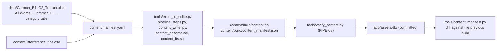

# 5. Technical reference

The facts a developer looks up: the stack and its versions, the repository
layout, the two databases, the content pipeline, each domain engine, the
shared components, the provider and settings catalogues, the tools, the
coding standards and the decision records. Versions are those of
`app/pubspec.yaml` and `app/pubspec.lock` at v1.0.1 (main `0d23968e`).
[Chapter 4](04-architecture.md) explains how the pieces fit together.

> The detailed specs in [`docs/`](../README.md) win if anything here
> disagrees with them. Each section links the spec it summarises.

## The stack

### SDK and platform

| | Version | Notes |
|---|---|---|
| Flutter | 3.47.5 (stable) | Pinned in `.fvmrc`; used from `PATH` (no fvm on the build machine) |
| Dart | 3.13.4 | `environment: sdk: ^3.13.0` |
| Android | minSdk 26, compileSdk and targetSdk 37 | ADR 19. Java 17, core library desugaring on (`desugar_jdk_libs` 2.1.5) |
| Android Gradle Plugin | 9.1.0 | Kotlin 2.4.0, with the Compose compiler plugin for the Glance widget |
| iOS | 16.0+ (target) | Swift Package Manager. Not released in v1.0 |

### Packages

The `pubspec.yaml` constraint, then what the lock resolves. "Unused" means no
Dart file under `lib/` imports it at v1.0.1.

| Concern | Package | Constraint → lock | Used for |
|---|---|---|---|
| Design system | `material_ui`, `cupertino_ui` | ^1.2.0 → 1.2.0, ^1.0.2 → 1.0.2 | Material and Cupertino, outside the SDK (ADR 6) |
| State | `flutter_riverpod`, `riverpod_annotation` | ^3.4.3 → 3.4.3, ^4.0.7 → 4.0.7 | Providers, codegen only (ADR 4) |
| Routing | `go_router` | ^18.0.1 → 18.0.1 | Typed routes, the tab shell, deep links (ADR 5) |
| Database | `drift`, `drift_flutter`, `sqlite3` | ^2.35.0 → 2.35.0, ^0.3.1 → 0.3.1, ^3.6.0 → 3.6.0 | Typed SQL, streams, migrations, FTS5 (ADR 3, 14) |
| Localisation | `flutter_localizations`, `intl` | SDK, ^0.20.3 → 0.20.3 | ARB, number formats |
| Voice | `flutter_tts`, `flutter_onnxruntime`, `just_audio` | ^4.2.5 → 4.2.5, ^1.8.5 → 1.8.5, ^0.10.6 → 0.10.6 | The phone's voice, Supertonic 3, playback (ADR 8) |
| Recording | `record` | ^7.1.1 → 7.1.1 | The Speaking exam |
| Translation | `llamadart` | ^0.8.24 → 0.8.24 | Bundles llama.cpp's CPU backend (ADR 27); no Dart code calls it yet, since Hy-MT is off (#154, Later) |
| Downloads | `background_downloader` | ^9.6.2 → 9.6.2 | Model downloads |
| Reminders | `flutter_local_notifications`, `timezone` | ^22.3.1 → 22.3.1, ^0.11.1 → 0.11.1 | The daily reminder |
| Widget | `home_widget` | ^0.10.0 → 0.10.0 | The snapshot the Glance widget reads |
| Background | `workmanager` | ^0.10.10 → 0.10.10 | The three background tasks |
| Files | `path_provider`, `file_picker`, `share_plus` | ^2.1.6 → 2.1.6, ^13.1.0 → 13.1.0, ^13.3.0 → 13.3.0 | App-support storage, export and import |
| Web links | `url_launcher` | ^6.3.2 → 6.3.2 | Dictionary links in an in-app browser view |
| Charts | `fl_chart` | ^1.2.0 → 1.2.0 | M2's progress charts |
| Platform | `permission_handler`, `package_info_plus` | ^13.0.2 → 13.0.2, ^10.2.1 → 10.2.1 | Mic and notification permissions; the app version in About |
| Checksums | `crypto`, `convert` | ^3.0.6 → 3.0.7, ^3.1.2 → 3.1.2 | SHA-256 of model files, hashed in chunks |
| Unused | `flutter_custom_tabs`, `flutter_animate`, `device_info_plus`, `freezed_annotation`, `json_annotation`, `logging` | lock: 2.6.0, 4.5.2, 13.2.0, 3.1.0, 4.12.0, 1.3.0 | Declared but not imported (removing them needs the `pubspec` lock) |

Dev dependencies: `build_runner` 2.16.1, `riverpod_generator` 4.0.9,
`go_router_builder` 4.5.0, `drift_dev` 2.35.0, `flutter_lints` 6.0.0,
`riverpod_lint` 3.1.9 (a native analyser plugin, ADR 15), `integration_test`;
`freezed` 4.0.2, `json_serializable` 6.14.1, `mocktail` 1.0.5 and `alchemist`
0.14.0 are present but unused. `pubspec.yaml` also sets llamadart's
native-assets `user_defines` so only llama.cpp's CPU backend is bundled (ADR
27: the arm64 APK went from 159.5 MB to 72.3 MB). The rationale for each
choice, and the rejected alternatives, are in
[`tech-stack.md`](../01-architecture/tech-stack.md).

## The repository

```
deutschplan/
├── app/                              the Flutter app (package sogda)
│   ├── pubspec.yaml · l10n.yaml · analysis_options.yaml
│   ├── lib/
│   │   ├── main.dart · bootstrap.dart
│   │   ├── core/                     adaptive/ components/ providers/ theme/ typography/
│   │   ├── data/db/                  user_schema.drift, content.drift, content_schema.drift,
│   │   │                             *_queries.drift, app_database.dart, content_dao.dart, content_update.dart
│   │   ├── data/repositories/        24 files: repositories, services over them, setting_keys.dart
│   │   ├── domain/                   19 pure-Dart files (the engines)
│   │   ├── features/                 14 screen groups
│   │   ├── router/                   routes.dart, app_router.dart, app_shell.dart, guards, deep links
│   │   ├── services/                 tts/, translation/, downloads, reminders, background, widget, recorder
│   │   └── l10n/                     app_en.arb, app_bn.arb, ui_digits.dart (generated/ is gitignored)
│   ├── test/                         mirrors lib/, plus golden/ (harness, 55 golden files, goldens/)
│   ├── integration_test/             the emulator smoke and the perf driver
│   ├── assets/                       db/ (content.db + manifest), fonts/, licences/, models/manifest.json
│   ├── drift_schemas/                drift_schema_v1..v3.json, one fixture per user.db version
│   └── android/ · ios/               native: MainActivity, the Glance widget, launch screens
├── content/                          manifest.yaml (which workbooks), interference_tips.csv
├── data/                             the Excel workbooks (gitignored, only where content is edited)
├── tools/                            the Python tools and their pytest suite (tools/tests/)
├── docs/                             the specs (source of truth), design PNGs, this handbook
├── deutsch-plan-design-html/         Paper & Ink / Night Ink artboards, four canvases
├── deutsch-plan-v2-aurora-glass-html/  Aurora Glass artboards, the same four canvases
├── CLAUDE.md · ONBOARDING.md · AGENTS.md   the team's working guides
├── CHANGELOG.md · README.md
└── Makefile                          the entry points (make itself is not installed; see chapter 7)
```

Generated code is not committed (ADR 17): `*.g.dart`, `*.drift.dart`,
`lib/data/db/schema_versions.dart`, `test/db/generated/` and
`lib/l10n/generated/`. The schema fixtures and `content.db` are committed
(ADR 24).

## user.db

The learner's data, created from `app/lib/data/db/user_schema.drift`
([`user-database.md`](../02-data/user-database.md)). 17 tables, listed in
`AppDatabase.ownTables`, which `app_database_test` checks against the doc:

| Table | Holds |
|---|---|
| `settings` | Every preference, as text (typed by `SettingsRepository`) |
| `enrollments` | Steps started; one open row is the active step (a unique index enforces it) |
| `word_state` | FSRS state per word (stability, difficulty, due, reps, lapses), status, `card_mode`, `card_mode_manual` |
| `review_log` | Every rating, never deleted |
| `plan_items` | The daily plan; an open `new` row before today is the backlog |
| `grammar_state`, `grammar_practice_log` | Grammar scheduling (same FSRS fields) and practice history |
| `sentence_log` | Practice sentences shown, so they don't repeat within the gap |
| `quiz_attempts`, `quiz_answers` | Quizzes: direction, source, seed, each answer's verdict |
| `exam_attempts`, `exam_answers` | Mock exams; answer rows are pre-inserted so a crash resumes exactly |
| `custom_words` | "My words"; scheduled as `custom:<id>` wherever a course uid goes |
| `daily_stats` | Per-day totals for the streak and charts |
| `content_updates` | One row per installed course version, for Today's card |
| `translation_cache` | Translations (unused while Hy-MT is off) |
| `undo_stack` | The last actions, trimmed to 20 rows |

- **Version and migrations.** `AppDatabase.latestSchemaVersion` is 3, stored
  in `PRAGMA user_version` (ADR 23). `onUpgrade` runs drift's generated
  `stepByStep` in a transaction, then `PRAGMA foreign_key_check`: v1 → v2 added
  `content_updates.recorded_at`, v2 → v3 added `word_state.card_mode_manual`
  (#316). Each version's shape is a committed fixture in
  `app/drift_schemas/`, and `test/db/migration_test.dart` migrates every
  fixture forward. Columns with data are never dropped.
- **Transactions.** A rating is one transaction (word_state, review_log,
  plan_items, daily_stats, undo_stack); a day's plan is one; exam answers are
  written one question at a time.
- **Backups.** Export writes every table except `translation_cache` and
  `undo_stack` to JSON with the schema version; import replaces or merges
  (the most recent `last_review` wins per word).

## content.db

The course, read-only, attached as schema `c`
([`content-database.md`](../02-data/content-database.md)). At v1.0.1 it is
8.0 MB, `content_version` 202609260837, with 5,593 words, 11,186 example
sentences, 182 grammar topics, 159 categories and 622 interference tips.

| Table | Holds |
|---|---|
| `meta` | `content_version`, `built_at`, `sources`, `word_count`, `sublevel_week_boundaries` |
| `levels`, `sublevels` | A1–C2, and the 12 steps A1.1–C2.2 with their word and grammar counts |
| `categories` | Word categories (English names in both UI languages) |
| `words` | One row per entry: `uid`, step, `article`, `german`, `forms`, `pos`, `pron_bn`, `english`, `bangla`, `freq`, category, `search_key`, `search_key_alt`, … |
| `word_examples` | Example sentences (German, English) |
| `grammar_topics` | Topic, rule, example, *watch out*, tags |
| `interference_tips` | L1-specific traps, resolved from the CSV at build time |
| `skill_prompts` | Empty by design (#294) |
| `words_fts` | FTS5 `unicode61 remove_diacritics 2`: exact and prefix search |
| `words_trigram` | FTS5 `trigram`: candidates for fuzzy search |
| `examples_fts` | FTS5 over example sentences: the "in sentences" tier |

`app/assets/db/content_manifest.json` ships beside it: counts, per-step
boundaries and every uid with two digests (`words`, what the learner sees, and
`meanings`). The app keeps the previous version's manifest, and diffing the
two is how a content update says what changed.

## The content pipeline

Excel is the authoring tool; the app never opens a workbook (ADR 1,
[`content-pipeline.md`](../02-data/content-pipeline.md)).



- Columns are read by header name (`HEADER_MAP`). The rules are PIPE-01 to
  PIPE-08: level from the word's own cell; each level split into X.1 and X.2 at
  the week nearest the middle; `uid = sha1(level|german|pos|english)[:16]`;
  search keys (lower case, article stripped, umlauts folded) byte-identical to
  `domain/text_norm.dart`, shared through `tools/test_vectors.json`; formula
  cells stored as text; examples paired by line; `content_version` is the
  build time `YYYYMMDDHHMMSS`, read once with `built_at`; verification fails on a missing column, an empty
  step, a word without an example, a uid collision, empty FTS tables or a
  misplaced tip.
- **Rebuild and verify** (from the repository root, with the workbooks in
  `data/`): `python tools/excel_to_sqlite.py`, then
  `python tools/verify_content.py`, then copy `content/build/content.db` and
  `content_manifest.json` into `app/assets/db/`. Review what changed with
  `python tools/content_manifest.py app/assets/db/content_manifest.json content/build/content_manifest.json`,
  and run `flutter test test/db/` from `app/`.
- Changing a word's `german`, `pos` or `english` changes its uid and resets
  learners' progress on it ([`adding-content.md`](../05-dev-guide/adding-content.md)).
- `python tools/mirror_content_schema.py` rewrites `content_schema.drift` from
  the pipeline DDL; `content_schema_test` fails if they disagree.

## The domain engines

All in `app/lib/domain/`, pure Dart. Each paragraph names its spec.

**FSRS scheduler** (`fsrs.dart`, [`fsrs-scheduler.md`](../03-domain/fsrs-scheduler.md)).
FSRS-4.5 with the 17 published default weights (ADR 7), day-granular and
deterministic. `desired_retention` (default 0.90) comes from settings. Elapsed
days are counted in local calendar days, so a daylight-saving change never
gives 0 or 2 (#327). Intervals are clamped to 1–36,500 days. Reference values
the tests pin: first intervals 1 / 1 / 4 / 14 days at 90 %, and a chain of
Good reviews 4 → 15 → 50 → 150 → 409 (the owner's decision on #239). The
rating bar's preview is `review(state, r, now).scheduledDays` for each r.
Grammar topics use the same class on `grammar_state`.

**Plan engine** (`plan_engine.dart`, `plan_stats.dart`, [`plan-engine.md`](../03-domain/plan-engine.md)).
`openDay(date)` is idempotent and atomic (`PlanStore.atomically`, #548): it
fills missed study days' new words up to `backlog_catchup_days`, picks
`revise_count` revision cards (due first, then lowest retrievability), adds
grammar due and the day's sentences. When a step runs out it completes the
enrolment and, with `auto_advance`, enrols the next. It implements
BR-PLAN-01…10: rest days, the backlog, the backlog pause, the streak (each
past day judged by the study-days mask in force on it, #377), the time
estimate and day completion. `DryRunPlanStore` lets `previewDay` run the real
logic without writing.

**Quiz builder** (`quiz_builder.dart`, `quiz_queue.dart`, `compare_set.dart`, [`quiz-engine.md`](../03-domain/quiz-engine.md)).
Builds a `Quiz` from `QuizArgs(direction, length, source, timer, seed)`.
Sources are a step's learned words, all learned words, a category or a
compare set; directions are deEn, deBn, enDe, articles, listening, forms,
mixed and compare. Words are ranked by retrievability and drawn in a seeded
shuffle from the weakest twice-`length`, so quizzes double as revision. Meaning
items carry four tiles with distractors of the same part of speech and step,
never a synonym. Every item not answered correctly is re-asked once at the
end (BR-QUIZ-01), and each first answer is rated into FSRS.

**Exam generator and grading** (`exam_generator.dart`, `exam_grading.dart`, [`exam-generator.md`](../03-domain/exam-generator.md)).
`buildExam(pool, seed:, listening:, bangla:, sat:)` draws a step's three mock
papers together from `Random(hash(step, seed))` (ADR 10), so no item repeats
across them. A paper has nine sections: 40 one-point questions (Vocabulary 10,
Reverse 8, Articles 6, Word forms 4, Gap fill 6, Grammar 4, Listening 2) and a
writing and a speaking task worth 4 points each, 48 points in all. Papers already sat are excluded. Grading scores each item
with `answer_check`, the writing task by target words and length plus its
two rubric ticks (only with a text), the speaking task by its four (only with
a recording), a point a tick, and passes at
`exam_pass_percent` (default 60).

**Answer checking** (`answer_check.dart`, `text_norm.dart`, `edit_distance.dart`, [`answer-checking.md`](../03-domain/answer-checking.md)).
`checkMeaning`, `checkGerman`, `checkArticle` and `checkForm` return correct,
almost, wrongArticle or wrong (BR-ANS-01…04), scored 1, 0.5, 0 and 0.
Normalisation matches the Python pipeline byte for byte. Distance is optimal
string alignment, so a transposition counts as one edit.

**Grammar practice** (`grammar_item_generator.dart`, [`grammar-practice.md`](../03-domain/grammar-practice.md)).
Turns one grammar topic into 3–5 items from its rule, example and *watch out*:
gap fill, pick the form, spot the error, order the sentence (word-order topics)
and rule recall (C1–C2). Wrong forms are real forms of the answer's word from
the course (#330, #406), read once per database by `course_text.dart`. All
correct rates Good, one wrong Hard, more Again.

**Practice sentences** (`sentence_picker.dart`, [`sentences.md`](../03-domain/sentences.md)).
Picks `sentence_count` example sentences whose words the learner mostly knows,
with distinct headwords and no repeat within `sentence_repeat_gap_days`.
"Not yet" also rates the headword Hard.

**Search** (`data/repositories/search_repository.dart`, [`search.md`](../03-domain/search.md)).
Four tiers, de-duplicated by uid: exact (search keys or the Bangla text),
starts with (`words_fts`), similar (trigram candidates filtered by edit
distance 2, or 3 for queries over five letters) and in sentences
(`examples_fts`). It runs on drift's isolate after a 120 ms debounce, can be
limited to a step, and offers dictionary links (Duden, DWDS, Wiktionary,
Linguee, Google).

**Smaller engines.** `cloze.dart` (where a cloze card blanks its sentence),
`placement.dart` (S3's adaptive placement check), `progress_stats.dart` (M2's
views), `word_of_day.dart` (the widget's word, seeded by the date) and
`reminder_times.dart` (the week of reminder instants).

**Voice** (`services/tts/`, [`tts.md`](../03-domain/tts.md)).
`TtsEngine { name, isAvailable, speak, stop, state }` with two engines:
`SystemTts` (flutter_tts, `de-DE`) and `SupertonicTts` (Supertonic 3 over ONNX
Runtime, voices Anna `F1.json` as default, Jonas `M1.json`, Lena `F2.json`).
`TtsService` picks the engine from `tts_engine`, falls back to the phone's
voice with a once-a-session toast, owns one player, and caches the last 200
clips on disk (`SynthesisCache`). T2 prepares its cards' clips ahead (#430).

**Reminders, background tasks and the widget** ([`notifications-widget.md`](../03-domain/notifications-widget.md)).
`ReminderScheduler` keeps a week of daily reminders in step with the settings;
`reminder_compose` writes the day's plan into the text or cancels it when
nothing is due; `plan_pregenerate` opens the day at 00:05 and keeps the week
rolling; the widget snapshot is written at midnight, hourly and whenever it
changes.

**Translation** (off; [`translation.md`](../03-domain/translation.md)).
The `Translator` interface exists (`services/translation/translator.dart`),
with `UnavailableTranslator` as its only implementation. Hy-MT is off in every
v1.0 build (ADR 9, `ENABLE_HYMT_DOWNLOAD` unset); a licence-clean replacement
is the owner's question #533.

## Shared components

In `app/lib/core/`; screens reuse these rather than drawing their own.

| Component | File | What it is |
|---|---|---|
| `SgText`, `SgHeadword`, `SgOneLine`, `SgRuns`, `SgGermanRuns`, `SgScript` | `typography/sg_text.dart` | All text: roles, the Bangla step-up, language tags, syllable and akshara breaking |
| `SgSurface` (`SgSurfaceKind.card`, `cardStrong`, `bar`, `tint`) | `theme/sg_surface.dart` | The only surface: solid in light and dark, frosted in glass |
| `SgTokens`, `context.tokens` | `theme/sg_tokens.dart` | Colour, surface, type, shape, spacing and motion tokens per mode |
| `AuroraBackdrop`, `GlassCapability` | `theme/` | The glass backdrop, and whether this device may blur |
| `SgButton` (primary, secondary, text) | `components/sg_button.dart` | Every button |
| `SgChip` (step, status, filter, streak, webLink), `SgPill` | `components/` | Chips and pills |
| `SgProgressRing`, `SgSegmentedBar` | `components/sg_progress_ring.dart` | Today's ring, progress bars |
| `SgRatingBar` | `components/sg_rating_bar.dart` | Again, Hard, Good, Easy with their intervals |
| `SgUmlautBar`, `SgCallout`, `SgErrorPanel`, `SgVerdictRow`, `SgToast`, `SgUndo` | `components/sg_feedback.dart` | The umlaut keys under a German field, callouts, the error panel with Retry, verdicts, toasts and undo |
| `SgSlider`, `SgStepper`, `SgSpeakerButton`, `SgCoachMark` | `components/` | Settings controls, the speaker with its three states, the one-time coach mark |
| `Adaptive*` | `adaptive/adaptive.dart` | All platform chrome ([chapter 4](04-architecture.md#adaptive-chrome)) |

Feature-level widgets reused across screens include `WordRow`
(`features/words/word_row.dart`), `PracticeHeader`, `StudyAnswerField`,
`SessionArgs` and `QuizArgs` (ONBOARDING §5, "Reuse before you write").

## Providers

From [`state-management.md`](../01-architecture/state-management.md); the
architecture test holds the keepAlive set to this list.

| Provider | Type | What it gives |
|---|---|---|
| `appDatabase` | keepAlive | The open user.db with content.db attached (overridden by bootstrap) |
| `settings` | keepAlive | The loaded `SettingsRepository` (overridden by bootstrap) |
| `clock` | keepAlive | `DateTime Function()`, the only "now" |
| `theme`, `languages` | keepAlive notifiers | Light, dark or glass; the UI and meaning languages |
| `tts`, `systemTts`, `supertonicTts`, `supertonicVoice` | keepAlive | The voice service and its engines |
| `modelRepository`, `modelDownloads` | keepAlive | Model files on disk; the download manager |
| `notificationPermission` | keepAlive | Asks whether the app may post |
| `studySession(args)` | keepAlive notifier | The session queue, position and undo stack |
| `onboarding` | keepAlive notifier | S2's draft until the finish commits it |
| `todayPlan`, `todayOpen` | Future, Stream | `openDay(today)`, and today's open rows |
| `wordDetail(uid)`, `wordHistory(uid)`, `recentlyUpdated`, `compareView(uid)` | autoDispose | W1, the *Updated* chip, W2 |
| `searchResults(query)`, `stepProgress`, `grammarCourse` | autoDispose | Search, per-step progress, the course text grammar practice checks against |
| `examRunService`, `modelCard(id)`, `phoneSpace`, `ttsPlayback` | autoDispose | L12's reads and writes, M4's cards, what the voice is sounding |

The repositories and services (`wordRepository`, `planRepository`,
`ratingService`, `examRepository`, `searchRepository`, `backupRepository`,
`planEngine`, `quizBuilder`, …) are auto-disposed providers in
`app/lib/core/providers/app_providers.dart`, except the few that
`state-management.md` lists as keepAlive (the model repository among them).

## Settings keys

From [`user-database.md`](../02-data/user-database.md), whose table
`settings_repository_test` parses against `setting_keys.dart`.

| Key | Default | Key | Default |
|---|---|---|---|
| `daily_new` | 7 | `ui_language` | `en` |
| `revise_count` | 10 | `meaning_language` | `both` |
| `sentence_count` | 3 | `theme_mode` | `system` (light / dark / glass) |
| `sentence_repeat_gap_days` | 14 | `show_pron_bn` | 1 |
| `study_days_mask` | 127 (Mon–Sun) | `tts_engine` / `tts_voice` / `tts_speed` | supertonic / Anna / 1.0 |
| `study_days_history` | — | `autoplay_headword` / `autoplay_example` | 1 / 0 |
| `reminder_enabled` / `reminder_time` / `reminder_only_when_due` | 0 / 19:30 / 1 | `exam_unlock_percent` / `exam_pass_percent` / `exam_timer_default` | 90 / 60 / 1 |
| `auto_advance` | 1 | `exam_timer` | 1 |
| `pause_new_when_backlog` | 0 | `mt_enabled` | 0 |
| `backlog_catchup_days` | 30 | `listening_questions` | 1 |
| `desired_retention` | 0.90 | `models_wifi_only` | 1 |
| `done_stability_days` | 7 | `quiz_custom_words` | 0 |
| `swipe_to_rate` | 0 | `coach_mark_seen` | 0 |
| `last_planned_date`, `planned_study_days` | —, 0 | `dismissed_cards`, `recent_searches` | — |
| `learner_name` | — | `last_export` | — |

## The tools

Python 3.10+, run from the repository root unless noted. Their tests are
`python -m pytest tools/tests -q` (22 test files).

| Tool | What it does | Run it |
|---|---|---|
| `excel_to_sqlite.py` | Compiles the workbooks into `content/build/content.db` and its manifest (with `pipeline_steps.py`, `content_writer.py`, `content_schema.sql`, `content_fts.sql`) | `python tools/excel_to_sqlite.py [--manifest …] [--out …]` |
| `verify_content.py` | PIPE-08's checks on a built content.db | `python tools/verify_content.py [--db …]` |
| `content_manifest.py` | Diffs two manifests: added, removed, changed, meaning | `python tools/content_manifest.py OLD NEW [--json]` |
| `mirror_content_schema.py` | Writes `content_schema.drift` from the pipeline DDL | `python tools/mirror_content_schema.py` |
| `trim_schema_fixture.py` | Removes the content tables from a dumped user.db fixture | after `dart run drift_dev schema dump …` (chapter 7) |
| `plant.py` | Planted violations: breaks the code on purpose and checks a test fails | `python tools/plant.py plants.json ["name"] [--kill-own-testers]` |
| `artboard.py` | Tiles artboards (HTML rendered with headless Edge or Chrome) beside goldens, to compare by eye; needs Pillow | `python tools/artboard.py out.png A.png B.html …` |
| `device.py` | Drives the emulator: install the release APK, tap by label, type, screenshot | `python tools/device.py install launch tap:Learn shot:x.png` |
| `smoke.py` | The integration smoke: three `integration_test` files on the emulator | `python tools/smoke.py [--device …]` |
| `perf.py` | Size, frames, start and search against `perf_baseline.json` | `python tools/perf.py size\|frames\|start\|all [--update-baseline]` |
| `release_android.py` | Builds the signed, obfuscated app bundle; checks 16 KB alignment and the signing key | `python tools/release_android.py [--check]` |
| `licences.py` | Checks, or re-fetches, the bundled licence texts and that every package ships a LICENSE | `python tools/licences.py check\|update` |
| `render_design.py` | Renders the Paper & Ink artboards to `docs/design/` (needs Playwright) | `python tools/render_design.py` |
| `team.py` | The agents' board on the `team` branch: identities, claims, handoffs, locks, the device lock | `python tools/team.py status` (ONBOARDING §3) |

Data beside them: `requirements.txt` (openpyxl, PyYAML, pytest),
`test_vectors.json` (the shared search-key vectors), `perf_baseline.json`,
and `fixtures/make_workbooks.py` (invented workbooks with the real sheets, headers and quirks, for the pipeline's tests, since the real ones are not in git).

## Coding standards

Binding: [`coding-standards.md`](../05-dev-guide/coding-standards.md), plus
the practice in ONBOARDING §6.

- **Lints.** `flutter_lints`, `riverpod_lint` and `prefer_final_locals`,
  `avoid_dynamic_calls`, `require_trailing_commas`,
  `always_declare_return_types`, with zero issues under
  `dart analyze --fatal-infos` (no path arguments, never `flutter analyze`,
  ADR 18). `dart format` is the style. Generated code is excluded.
- **Imports.** `package:material_ui/…` and `package:cupertino_ui/…`, never the
  SDK's Material or Cupertino; `package:sogda/…` everywhere, no relative
  imports.
- **Values.** `@immutable` classes, records, enums and `sealed` hierarchies
  (`ExamItem`, `GrammarItem`, `BootstrapResult`, `SettingKey`). No `@freezed`
  class exists.
- **Text.** `SgText(role:)`, never `Text`; every string in both ARB files, with
  an `@key` description in English naming the screen; fixed German UI copy is
  ARB and says so. A genuine non-copy literal is marked
  `// ponytail: allow-literal`.
- **Data.** Every write in a transaction; streams for what the UI watches;
  never a query in `build()`; local dates for plans, UTC for timestamps; the
  clock provider for "now".
- **Comments** explain why and name the FR/BR ids they implement. A deliberate
  shortcut is `// ponytail: <why, and its ceiling>`.
- **Accessibility.** Every tappable thing is a labelled button in semantics,
  48 dp / 44 pt targets, never colour alone, 200 % text and reduce motion.
- **Privacy.** No network call without a user action; no analytics; no
  `print`; no logging of content.
- **Commits.** Conventional Commits, lower case, British spelling, scope =
  area, `(#N)` at the end; one issue, one branch, one squash-merged PR.

## Decision records

The full table, with each decision's reason and when to revisit it, is
[`decisions.md`](../05-dev-guide/decisions.md). One line each:

| # | Decision |
|---|---|
| 1 | Excel is the authoring format, compiled to SQLite |
| 2 | Two databases: content.db (read-only, attached) and user.db |
| 3 | drift over raw sqlite3 |
| 4 | Riverpod 3 with code generation |
| 5 | go_router 18 with `StatefulShellRoute` |
| 6 | Start on `material_ui` / `cupertino_ui` (Flutter 3.47) |
| 7 | FSRS-4.5 with default weights; optimisation after 1,000 reviews |
| 8 | Supertonic 3 via flutter_onnxruntime, with the system voice as fallback |
| 9 | Hy-MT1.5-1.8B via llamadart behind `ENABLE_HYMT_DOWNLOAD`, off in every v1.0 build |
| 10 | One seeded exam generator, seeds 1–3 |
| 11 | Three theme modes; glass through one `SgSurface` renderer |
| 12 | No dynamic (Material You) colour |
| 13 | No analytics, no accounts |
| 14 | `sqlite3` 3.x instead of the end-of-life `sqlite3_flutter_libs` |
| 15 | Drop `custom_lint` (riverpod_lint is a native analyser plugin) |
| 16 | Current majors for eight plugins ahead of the tech-stack table |
| 17 | Generated code is not committed |
| 18 | Lint with `dart analyze --fatal-infos`, not `flutter analyze` |
| 19 | Android compileSdk and targetSdk 37, minSdk 26, desugaring on |
| 20 | `kotlin.incremental=false` (file_picker's Windows cache bug) |
| 21 | Pin the Material `ColorScheme` fields Material widgets read |
| 22 | One `user_schema.drift` is both the DDL and the generation source |
| 23 | `PRAGMA user_version` instead of a `schema_version` table |
| 24 | Commit the schema fixtures; gitignore what is derived from them |
| 25 | `skill_prompts.text` renamed to `prompt` (drift name clash) |
| 26 | content.db attached by plain path, read-only by construction |
| 27 | llamadart ships llama.cpp's CPU backend only (159.5 → 72.3 MB) |

The next free number is 28; take the `adr-number` lock before writing it.
