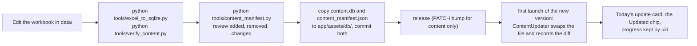

# 7. Operations

How to set up a machine, run the everyday commands, build a release, ship a
content update and get out of trouble. Sogda is built on Windows 11 by
a team of agents working in separate git worktrees, with no `make`, no `fvm`
and no GitHub CI, so every command here is the one that actually runs. v1.0
ships on Android only; the iOS pipeline waits for a Mac.

> The detailed specs in [`docs/`](../README.md) win if anything here
> disagrees with them, chiefly
> [`getting-started.md`](../05-dev-guide/getting-started.md),
> [`release.md`](../05-dev-guide/release.md),
> [`store-listing.md`](../05-dev-guide/store-listing.md) and
> [`content-pipeline.md`](../02-data/content-pipeline.md). The team process is
> [`ONBOARDING.md`](../../ONBOARDING.md).

## Setting up a machine

| What | Version, and where |
|---|---|
| OS | Windows 11, commands in Git Bash (PowerShell where a doc says so). macOS or Linux work for everything but the goldens, which are verified on Windows only |
| Flutter | 3.47.5 with Dart 3.13.4, on `PATH`. `.fvmrc` pins it; check `flutter --version` matches. fvm is optional (`getting-started.md`, "Using fvm") |
| Python | 3.10+ with `pip install -r tools/requirements.txt` (openpyxl, PyYAML, pytest). `tools/artboard.py` also needs Pillow; `tools/render_design.py` needs Playwright |
| Android | The Android SDK with API 37 (compileSdk and targetSdk), platform-tools, the emulator and an API 36 system image. The NDK is Flutter's own. On Windows the SDK is usually at `%LOCALAPPDATA%/Android/Sdk` (else set `ANDROID_HOME`); put its `emulator` and `platform-tools` folders on `PATH` |
| iOS | Xcode 16+ with an iOS 16 simulator, on a Mac only. Not needed for v1.0 |
| GitHub | `gh`, logged in as `rahmat-ullah` |
| Memory | About 32 GB, often only ~4 GB free. A release build starts a Gradle daemon with an 8 GB heap (`org.gradle.jvmargs=-Xmx8G`), so build APKs one at a time, under the device lock |

**Clone and identity.** Everything that reaches GitHub is authored as the
owner, and the repository's `.git/config` sets it; never override it:

```bash
git clone https://github.com/MdRahmatUllah/DeutschPlan.git deutschplan
cd deutschplan
git config user.name  "MdRahmatUllah"
git config user.email "rahmat.ullah@infinitibit.com"
```

Commit messages end with the agent's `Co-Authored-By:` line, and PR bodies
start with `**Agent-N**` and end with the Claude Code footer.

**One worktree per agent.** The main checkout stays on `main` for the owner.
Each agent works in its own worktree and keeps it (its build cache is worth
gigabytes):

```bash
git fetch -q origin
git worktree add --detach ../dp-wt/agent-N origin/main
cd ../dp-wt/agent-N
python tools/team.py agents           # pick an idle identity
python tools/team.py join agent-N     # clones the board to <root>/dp-team/agent-N
```

**Generate the code.** Generated code isn't committed (ADR 17), so a new
worktree, and any rebase or branch switch that touches `.drift` files,
providers, routes or ARB files, runs this (the Makefile's `gen` target):

```bash
python tools/mirror_content_schema.py
cd app
flutter pub get                                              # also generates l10n
dart run drift_dev schema steps drift_schemas/ lib/data/db/schema_versions.dart
dart run drift_dev schema generate drift_schemas/ test/db/generated/
dart run build_runner build --delete-conflicting-outputs
```

The first `flutter test` in a new worktree downloads sqlite3's
native library through its build hook: it needs the network, once.
`app/assets/db/content.db` is committed, so a first run builds no content. The
Excel workbooks are not in git; they live in the main checkout's `data/` and
are copied in only for a content change.

**Emulators.** Create two API 36 AVDs and start them on fixed ports, so the
serials match what the tools enforce:

```bash
emulator -avd <dev-avd> -port 5558     # the developers', tools/device.py's default
emulator -avd <sqa-avd> -port 5554     # the SQA agent's: tools/device.py's SQA_SERIAL
```

| Serial | Who | Rule |
|---|---|---|
| `emulator-5558` | the developer agents | Shared under the local device lock: `python tools/team.py device` before any APK build or device check, `--release` after. The lock breaks after 45 minutes |
| `emulator-5554` | agent-3 (SQA) | Reserved for SQA by `tools/device.py` (`SQA_SERIAL`): agent-3's default, refused to anyone else. Use it on a new machine |
| `emulator-5556` | agent-3 (SQA), first machine only | Where SQA's emulator ended up on the first machine, with learner data kept between passes; agent-3 names it with `--serial emulator-5556`. Nobody else installs on it |

A plain `adb` call names its device (`adb -s emulator-5558 …`), since several
emulators run at once. Leave any other running emulator alone.

## Everyday commands

From `app/` unless the command starts with `python` (then from the repository
root). `make` isn't installed; the right-hand column is what each Makefile
target runs.

| To | Run | Makefile |
|---|---|---|
| Get packages and l10n | `flutter pub get` | |
| Generate code | the block above | `make gen` |
| Keep generating while editing | `dart run build_runner watch --delete-conflicting-outputs` | `make gen-watch` |
| Analyse and check format | `dart analyze --fatal-infos` then `dart format --output=none --set-exit-if-changed .` | `make lint` |
| Apply the formatter | `dart format .` | `make format` |
| Run tests | `flutter test --timeout 60s <files>`; the full suite `flutter test -j 2 --timeout 60s` at milestone completion; without goldens `flutter test --exclude-tags golden` | `make test` |
| The tools' tests | `python -m pytest tools/tests -q` | `make test-content` |
| Regenerate one screen's goldens | `flutter test --update-goldens test/golden/<screen>_golden_test.dart` | (`make update-goldens` rewrites all: avoid) |
| Run the app | `flutter run` | |
| A device-check build | `flutter build apk --release --target-platform android-x64 -P allowDebugSigning=true`, under the device lock (#705: without `key.properties` a release build fails unless it opts in) | |
| Drive the emulator | `python tools/device.py install launch tap:<label> shot:<file>` | |
| Capture a new user.db version | `dart run drift_dev schema dump lib/data/db/app_database.dart drift_schemas/` then `python ../tools/trim_schema_fixture.py` | `make schema-dump` |
| Clean | `flutter clean`, and delete `content/build/` | `make clean` |

The gate every PR merges on, and what else runs when, is
[chapter 6](06-quality.md#the-gate).

**Changing user.db's schema.** Take the `user-db-schema` lock on the board,
bump `AppDatabase.latestSchemaVersion`, edit `user_schema.drift`, capture the
fixture (the schema-dump row above), regenerate, add the `fromNToN+1` step,
and update [`user-database.md`](../02-data/user-database.md).
`test/db/migration_test.dart` then migrates every earlier fixture. Add
nullable columns or new tables; never drop a column with data.

## Releasing

### Versioning

`app/pubspec.yaml` carries `version: MAJOR.MINOR.PATCH+BUILD` (v1.0.1 was
`1.0.1+2`; the first Sogda build was `1.1.0+3`, #739, and v1.1.0 ships as `1.1.0+4`, #1123); `versionCode` and `versionName` come from it. The course has its
own `content_version` (the pipeline's build time), shown in About. A
content-only release bumps PATCH. v1.2.0's release commit is #1235's, a
draft PR (#1312) that merges last, after SQA's pass (#1234), the size and
performance measurement (#1306) and the screenshots (#1307).

### The checklist

From [`release.md`](../05-dev-guide/release.md), with the real commands:

1. **Checks green.** The analyser, formatter, full test suite and goldens
   (chapter 6), and the integration smoke (`python tools/smoke.py`, under the
   device lock).
2. **Content current.** Rebuilt from the workbooks if they changed, with the
   manifest diff reviewed (below).
3. **Licences.** `python tools/licences.py check`, after `flutter pub get`. It
   fails if a bundled model or font licence differs from its maker's, is
   missing or has no source, if a pubspec font family has no licence text
   (#719), or if a package ships no LICENSE file (which
   Flutter's `LicenseRegistry`, and so M8, would silently leave out).
   `python tools/licences.py update` fetches the texts again. Since v1.2.0
   it also holds PdfBox-Android's licence and NOTICE and Bouncy Castle's.
   ML Kit and Play's in-app review library come under Google's terms, not a
   licence text, so M8 names them with links written in the app, and
   nothing fetches them ([`about-licences.md`](../04-screens/about-licences.md)).
4. **No translation flag.** Hy-MT2's download is offered in every build
   (ADR 30); ADR 9's `ENABLE_HYMT_DOWNLOAD` is gone.
5. **The bundle.** `python tools/release_android.py --require-upload-key` (in an
   agent's worktree with the device lock held: an app build takes it; the
   owner's checkout has none to take). It fails on a missing engine or app
   library for any of the three ABIs, a misaligned one, a permission
   release.md doesn't list, a debug or unsigned bundle, or missing Dart
   symbols (32-bit ARM's too), which it keeps in
   `app/build/release-symbols/<version>/` once every check passes (#697, #858):
   - it builds `flutter build appbundle --release --obfuscate --split-debug-info=build/symbols`
     (plus `-P allowDebugSigning=true` unless `--require-upload-key`, #705) into `app/build/app/outputs/bundle/release/app-release.aab`;
   - **16 KB:** it reads the ELF headers of every 64-bit native library in the
     bundle (`arm64-v8a`, `x86_64`) and exits 1 if any loadable segment isn't
     16 KB-aligned, as Play requires of apps targeting Android 15+;
   - **key:** it says which certificate signed the bundle;
   - `--check` checks the last build without building. On 2026-09-26 it passed
     with AGP 9.1, and the bundle was 272 MB with all four ABIs.
   - **No library reports home** (BR-PRIV-01): after a dependency update,
     the release APK's merged manifest is read for `datatransport`,
     `firebase`, `clearcut` and `measurement`
     (`aapt2 dump xmltree --file AndroidManifest.xml`). ML Kit's DataTransport
     backend and schedulers are removed in the app's manifest (#1229).
6. **Performance.** `python tools/perf.py all`, then `all --profile year` (a
   year of study, #818), against the baselines; the owner's checkout takes no
   lock, and perf.py refuses while an agent holds the emulator (#845). Then the
   owner times cold and warm start by hand on a real mid-range phone. For
   v1.2.0, #1306 measures what each feature adds to the size, and D2's first
   frame on a 20,000-character text.
7. **Tag and notes.** The release commit bumps `pubspec.yaml`, adds the
   `CHANGELOG.md` entry, and updates *What's new* in English, Bangla, Polish
   and Russian in
   `store-listing.md` (`tools/tests/test_store_listing.py` reads the version
   from `pubspec.yaml` and holds every text to Play's limits). It is merged as
   `chore(release): vX.Y.Z, <summary> (#N)`, and that commit gets an annotated
   tag `vX.Y.Z`: `v1.0.0` is on `2b424e33` and `v1.0.1` on `0d23968e`.

### Signing

The app id is `de.sogda.app`, the owner's; it can never
change once the app is on Play (ADR 28). Release builds use the owner's upload
key when `app/android/key.properties` exists:

```
storePassword=…
keyPassword=…
keyAlias=upload
storeFile=C:/path/to/upload-keystore.jks
```

`key.properties`, `*.jks` and `*.keystore` are gitignored and never committed.
Without the file, a release build fails (#705), unless it opts in to the debug
key with `-P allowDebugSigning=true` (or `ORG_GRADLE_PROJECT_allowDebugSigning=true`),
so nothing is debug-signed by accident; Play refuses a debug-signed upload
anyway. The owner provides the upload key; the agents' worktrees have no
`key.properties`, so their device-check builds opt in, as `tools/device.py`,
`tools/perf.py` and `tools/release_android.py` (without `--require-upload-key`) do.

### Obfuscation and symbols

- Dart code is obfuscated. Its symbols are written per ABI to
  `app/build/symbols`; `flutter symbolize` needs them to read a crash's stack
  trace. Keep them with each release, **privately**: they hold the real names.
- The plugins' native symbol tables ride in the bundle
  (`debugSymbolLevel = "SYMBOL_TABLE"`), and Play symbolicates their crashes.
- R8 must keep `ai.onnxruntime.**` (`app/android/app/proguard-rules.pro`):
  ONNX Runtime finds its Java classes by name, and without the rule the first
  Supertonic synthesis crashes the release app.
- R8 must also keep `com.google.mlkit.**` and
  `com.google.android.gms.internal.mlkit_**` (#1229): without them the first
  photo read failed in its pipeline. ML Kit's other scripts, whose models
  aren't bundled, are `-dontwarn`, and so is pdfbox's optional JPEG 2000
  decoder (`com.gemalto.jp2.JP2Decoder`, ADR 31). A debug run shows none of
  this, so the documents' device checks use a release build.

### The size, release by release

The arm64-v8a APK of `flutter build apk --release --split-per-abi`, the
stand-in for Play's one-ABI download (chapter 3, *Performance*):

| Build | arm64 APK | What moved it |
|---|---|---|
| Before v1.0.0 | 159.5 → 72.3 MB | llama.cpp cut to its CPU backend (ADR 27) |
| v1.0.0 | 72.44 MB | The last `perf.py all` before the tag |
| v1.1.0 | 51.2 MB at llamadart's removal, 2026-09-27 | llamadart removed while Hy-MT was off (ADR 29) |
| v1.2.0, on main | 52.22 → 54.12 MB with pdfbox-android (ADR 31); ML Kit's text recognition adds about 12 MB a phone (`doc-import.md`) | Documents (#1228, #1229) |
| v1.2.0, with Hy-MT2 | 66.24 MB once #1318 took pdfbox's CJK CMaps out (−1.22 MB); 89.19 MB on 2026-10-03 with llama.cpp's CPU libraries back for Hy-MT2 (+22.95 MB) | #1318, #154 |

v1.2.0's own figure, feature by feature, is #1306's, and goes into its
release notes. A universal APK carries every ABI, so ML Kit alone adds 31 MB
to one (`doc-import.md`).

### Model downloads

The models are not in the app: `app/assets/models/manifest.json`, which
ships in it, pins each file's URL at a fixed revision and its SHA-256, so a
model changes only with an app update ([`model-manager.md`](../04-screens/model-manager.md)).

| Model | Where it comes from | Size |
|---|---|---|
| Supertonic 3 voice | `Supertone/supertonic-3` on Hugging Face, nine files | 399 MB |
| Hy-MT2 translation (v1.2.0) | `tencent/Hy-MT2-1.8B-GGUF` on Hugging Face, `Hy-MT2-1.8B-Q4_K_M.gguf` (ADR 30) | 1.1 GB (1,133,080,448 bytes) |

- **Both download the same way:** resumable, *Wi-Fi only* by default, a
  100 MB free-space margin, verified by checksum before they are used, and
  side by side under one notification (#1255). The space check counts the
  downloads still to come (#1261), and a failed download's part-files go
  once nothing is in flight (#1265).
- **If a file moves upstream,** downloads fail until an app update ships a
  new manifest (chapter 1, *Risks*). Mirroring the files is an open idea,
  not a decision.

### The Play listing and declarations

- **Texts.** Title, short and full description and *What's new*, in English
  (en-US) and Bangla (bn-BD), are in [`store-listing.md`](../05-dev-guide/store-listing.md).
  v1.1.0's listing doesn't mention translation, which it didn't have;
  Hy-MT2 arrives with v1.2.0, whose store notes say so. A native reader checks the
  Bangla before the first upload.
- **Screenshots.** `docs/05-dev-guide/store/phone-light`, `phone-dark`,
  `tablet-light` and `tablet-dark`, eight each (Today, a card's front and back,
  the course, a step, word detail, and since 1.2.0 a document's words and
  a word's card from it, #1307), from the release x86_64 APK on
  `emulator-5558`: phone 1080 × 2160, tablet 1600 × 2560, Android's demo-mode
  status bar, RGB PNGs without alpha. Bangla, Polish and Russian each have a
  phone set in their own app language (`bn-`, `pl-` and `ru-phone-light`), and
  every release re-shoots them all.
- **Data safety:** no data collected or shared; no account, analytics or ads.
  Model downloads fetch files and send nothing; *Report a problem* opens a
  pre-filled GitHub issue in the browser, which the learner sends or doesn't.
  A document's text and photos are read and kept on the phone (BR-DOC-01).
- **Permissions** (the merged manifest): `RECORD_AUDIO` (the Speaking exam,
  asked on the first Record), `POST_NOTIFICATIONS` (the reminder, asked when
  switched on), `RECEIVE_BOOT_COMPLETED` (reminders after a restart),
  `INTERNET` and `ACCESS_NETWORK_STATE` (model downloads and their Wi-Fi rule),
  `WAKE_LOCK` (WorkManager carrying a download on in the background), and
  `VIBRATE` (the reminder). No foreground service, so no foreground-service
  form (#611); `tools/release_android.py` checks this list. v1.2.0 adds
  none: the camera and the photos are the phone's own apps, through
  `image_picker`.

### iOS

Not in v1.0 (the owner, 2026-09-26). The iOS release pipeline (#171) and the
iOS widget (#161) are in the milestone "Later · after v1.0". When a Mac is
available: deployment target 16.0, SPM, `flutter build ipa --release` with the
same obfuscation flags, a privacy manifest (no tracking, the mic string,
notifications, the `fetch` and `processing` background modes) and the App
Group `group.de.sogda.app` shared with the widget extension.

## Content updates in production

A course change ships inside an app release; there is no content server.



- **Authoring** ([`adding-content.md`](../05-dev-guide/adding-content.md)):
  keep the header names, add words to *All Words* with a `Level`, avoid cells
  starting with `=`, `-`, `+` or `@`, one example per line. Add interference
  tips to `content/interference_tips.csv`. Then run `flutter test test/db/`
  and commit `content.db` and `content_manifest.json` together.
- **What a learner keeps.** Progress is keyed by word uid,
  `sha1(level|german|pos|english)[:16]`. Editing any other column keeps it.
  Changing a word's German, part of speech, English or level gives it a new
  uid: the build links the old uid to the new one when it is the same word, and
  the app moves the learner's progress along the link on install (PIPE-09),
  a grammar topic's too (#808); a wrong link is refused, and a missing one
  pinned, under `links:` in `content/corrections.yaml` (#807). A
  word gone with nothing to link it to stops the build unless
  `--allow-removed`; say so in the release notes.
- **On the phone.** At the first launch of the new version, `bootstrap()`
  compares the bundled `content_version` with the installed one, writes the
  new file beside the old, detaches, swaps and re-attaches it, diffs the kept
  manifest against the new one, and records the change in `content_updates`
  ([chapter 4](04-architecture.md#data)). The kept manifest is saved last, so
  an interrupted update runs again at the next launch. Removed words disappear
  from plans and lists but their rows stay; words whose meaning changed wear
  an *Updated* chip for 7 days; Today shows one card for the newest unseen
  update.
- **user.db migrations** ship the same way: a new schema version migrates the
  learner's file on the first open, in one transaction, followed by a foreign
  key check. A failure there shows the start-up error screen (FR-S1-03) with
  *Retry*, never a blank screen; *Export progress* is offered when the
  database opened, and *Share your data file* when it didn't: it shares
  `user.sqlite` with its `-wal`, so the learner's progress can still leave the
  phone (#619).

## Troubleshooting

From ONBOARDING §12:

| Symptom | Cause, and fix |
|---|---|
| `Target of URI doesn't exist: …g.dart`, or `schema_versions.dart` missing | Generated code isn't committed: run the generation block |
| `dart analyze` is clean for you but someone sees Riverpod errors | You passed paths or used `flutter analyze`. Run `dart analyze --fatal-infos` with no arguments |
| A screen shows stale data after a write | A raw `customStatement` with no `updates:` or `markTablesUpdated` |
| `The argument type … can't be a provider return type` | A drift row class in a provider signature: wrap it in a class or record |
| Unrelated router or golden tests throw `UnimplementedError` from `appDatabaseProvider` | A new screen isn't in `todayStub()` |
| `Flutter failed to delete … sqlite3.dll` | A stale `flutter_tester` from your own worktree: `python tools/plant.py x --kill-own-testers`. Never kill testers by name |
| `team.py`: `refused: …` | Read it: someone else holds it, or it is blocked. `team.py status` shows what is ready |
| `team.py`: "the board is busy" | Many agents pushed at once: run it again |
| `team.py`: "… is held by another team.py command on this clone" | Another command (a watcher's `status`, say) held your clone for four minutes. Find it, and any orphaned watcher loops, and stop them by PID. A lock left by a killed command is broken after two minutes (#1421) |
| `gh pr merge` prints `Aborting` | `--delete-branch` in a worktree. Check `gh pr view P --json state`, then `git push origin --delete <branch>` |
| "Head branch is out of date", or the PR is `CONFLICTING` | Rebase on `origin/main`, regenerate, run the basic check, push |
| The PR doesn't show your last push | `gh api repos/MdRahmatUllah/DeutschPlan/pulls/P --jq .head.sha`; close and reopen the PR if GitHub is stuck |
| `INSTALL_FAILED_INSUFFICIENT_STORAGE` | Use the release x64 APK; `tools/device.py install` trims caches and retries |
| uiautomator dumps are empty | An ANR dialog: `adb -s emulator-5558 reboot`, then wait for `sys.boot_completed` |
| `perf.py`: every trace's raster about 10× its baseline, for any build | The emulator process, not the app: a guest reboot doesn't clear it. Under the lock, `adb -s emulator-5558 emu kill`, start `emulator -avd Pixel_9 -port 5558 -no-snapshot-load` again, wait for `sys.boot_completed` (#1319) |
| `LF will be replaced by CRLF` | Noise from `core.autocrlf=true` |
| A generated script has broken `\n` or quotes | A bash heredoc mangled it: write the file with an editor |
| `file_picker` fails with "Could not close incremental caches" | Kept away by `kotlin.incremental=false` in `app/android/gradle.properties` (ADR 20) |
| A release build crashes on the first Supertonic clip | The R8 keep rule for `ai.onnxruntime.**` is missing |
| A release build crashes at launch, or its first photo read fails | ML Kit's R8 keep rules are missing (`proguard-rules.pro`, #1229) |
| A PDF fixture won't open on a Windows checkout | Its line ends were converted: `.gitattributes` marks `*.pdf` binary (#1228) |

## The team's working loop

The day-to-day process belongs to [`ONBOARDING.md`](../../ONBOARDING.md) and
[`CLAUDE.md`](../../CLAUDE.md); in short:

- Coordination lives on the `team` branch (`TASKS.md`, `STATUS.md`,
  `PLAN.md`, `MEMORY.md`, `WORKLOG.md`, `agents/`), changed only through
  `python tools/team.py` (`join`, `status`, `claim`, `log`, `review`, `done`,
  `msg`, `lock`, `device`, `leave`).
- One issue, one branch `feat/<N>-<slug>` (or `fix/`, `docs/`, `test/`,
  `chore/`) from `origin/main`, one PR with `Closes #N`, squash-merged as
  `gh pr merge P --squash --subject "<title> (#P)"`, never with
  `--delete-branch`; delete the branch afterwards with `git push origin --delete`,
  and only once the PR is merged.
- Shared locks on the board: `user-db-schema`, `adr-number`, `pubspec`,
  `ci-config` and `shared-look`.
- Owner decisions (app ids, signing, the store listing, the open questions)
  are parked with `team.py decision`, never guessed.
